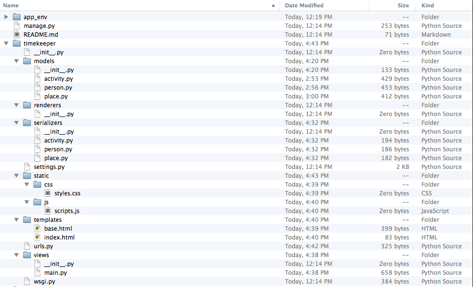
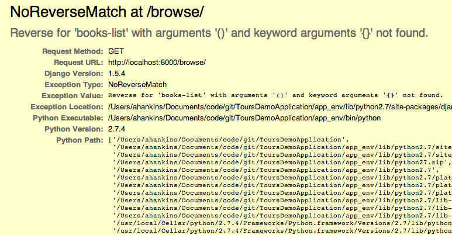
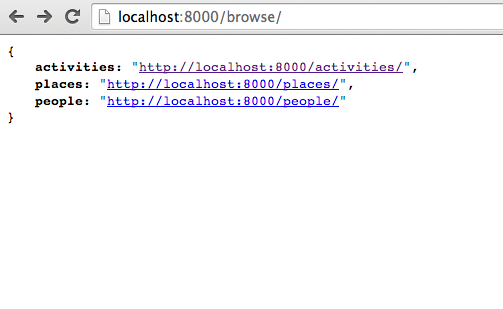
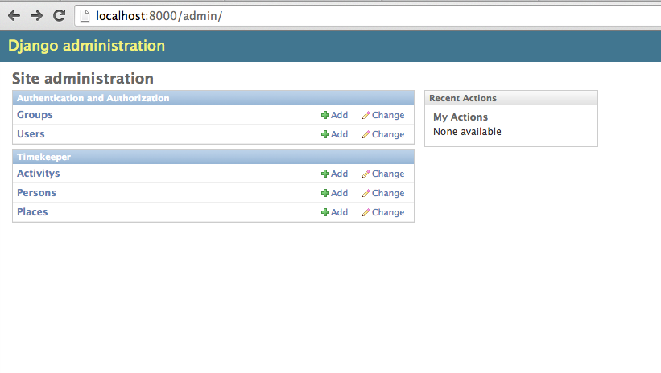
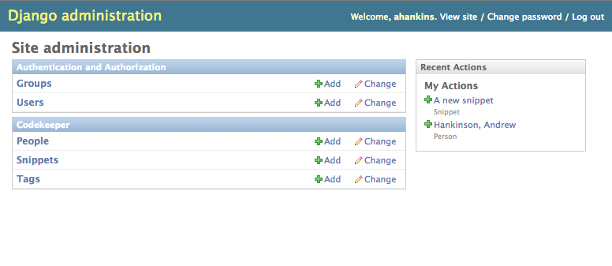
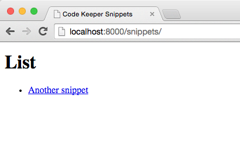

# Introduction

This tutorial will provide you with a comprehensive overview on how to build a RESTful Django web application. Along the way you will learn the following tools and concepts:

 * How to create and work with Python virtual environments
 * How to create and work with the Django web application system
 * Model-View-Controller, and how it works
 * Representation State Transfer (REST) best practices
 * HTTP Headers, and Web API-based requests
 * Asynchronous JavaScript communication (AJAX)
 * How to set up and maintain a Solr installation
 * Notification centres, and Django Signals
 * Automatic indexing and searching

By the end of this tutorial you should be able to understand how all of these components may fit together to form a complete, but simple, web application.

# Conventions and Assumptions

Commands to be typed in the terminal will be indicated by a monospaced font. Some commands may show the `$>` shell prompt. You should type everything that follows this prompt, but not the prompt itself.

Source code is given in `monospaced fonts`. 

# Getting Started

## Tools

Google Chrome is a very good browser to develop websites with. It has a very easy-to-use debugger, and there are several useful extensions that we can install to make development easier. For ease of use, I would suggest working with Chrome, along with a couple valuable extensions:

`JSON View` is an extension that formats JavaScript Object Notation (JSON) responses in a nice, human-readable form.

`Dev HTTP Client` is an extension that provides a client for interacting with a web server.

You should install both of these in your Chrome installation.

## Create your project directory

Create a directory where you will keep your files for this project. I have called mine "DjangoDemoApplication" -- you can call yours whatever you like.

`cd` to this directory.

## Install your environment

We will be using `virtualenv` to manage our Python installation. `Virtualenv` keeps your main Python installation separate from installations for dedicated projects. This allows you to run and maintain separate modules for each project.

First, install virtualenv:

`$> pip install virtualenv`

Now create a virtual environment:

`$> virtualenv app_env`

This will create a directory in your project directory called `app_env`. This directory will hold any Python modules you install. Every time you wish you use this environment you need to activate it:

`$> source app_env/bin/activate`

You will notice that your prompt now changes to include the name of your active environment:

`(app_env)$>`

While you are in an active environment, any Python modules you install will be local to this project only.

### Install required modules

We will start by installing some required modules (you must have your virtual environment active):

1. Django:  `$> pip install Django`*
2. Django Rest Framework: `$> pip install djangorestframework`
3. Solrpy: `$> pip install solrpy`
4. ipython: `$> pip install ipython`
5. South: `$> pip install South`
6. Django Extensions `$> pip install django_extensions`

`ipython` is a replacement interpreter for Python that makes it easier to work with Python on the command line.

* We will be working with Django 1.7+, so if it hasn't been officially released at this time you may need to install the beta version directly:

`$> pip install https://www.djangoproject.com/download/1.7b2/tarball/`

## Create your Django project

For the purposes of this example, we will be creating a simple time management web application. We'll call it "TimeKeeper".

We will start by creating the Django application:

`$> django-admin.py startproject timekeeper`

This will create a folder called 'timekeeper' with a number of files in it. I prefer a particular type of Django project layout when working with large projects, so we will need to re-arrange the files that are created by default.

Start by opening up your project in your file manager. You should see a "timekeeper" folder, and within that folder another "timekeeper" folder with four files in it: `__init__.py`, `settings.py`, `urls.py` and `wsgi.py`. We will start by moving these files out of the sub-folder and into the first "timekeeper" folder. Delete the second "timekeeper" folder.

Now you should have just one "timekeeper" folder, with five files in it -- the four previously mentioned, and `manage.py`. Move `manage.py` up one folder in your hierarchy.

In `wsgi.py` you will need to change one line. Look for this line:

`os.environ.setdefault("DJANGO_SETTINGS_MODULE", "timekeeper.settings")`

and change it to this:

`os.environ.setdefault("DJANGO_SETTINGS_MODULE", "settings")`

In your `timekeeper` folder, create the following new sub-folders: views, models, static, templates, serializers, and renderers. In views, models, serializers, and renderers, create an empty `__init__.py` file.

> The `__init__.py` file is a special file that allows Python to use a folder 
> as a module name. When writing your application you will typically start by 
> importing methods from other files, typically something like:
> `from timekeeper.views import someview`.
> This command will look in the folders `timekeeper/views` for a file, `someview.py`
> and import this file, making the classes and functions in it available.

You should now have something that looks like this:


Finally, we'll need to add our project to our `INSTALLED_APPS` section of `settings.py`. Open this file and add `timekeeper` to the end of the `INSTALLED_APPS` list. While you're there, also add `django_extensions` to the list, remembering to put a comma after each item of this list.

You should now be able to run `python manage.py` and have it execute without errors. You should now be ready to build your application.

# System architecture

Now that we have Django set up, let's step back for a minute and consider the web application we want to build. For the purposes of this example, we want to build a web application that keeps track of a person's time spent doing a particular activity. We will start by identifying the principle functional requirements of this web application.

To start, we should identify the different data types that we want to track. To keep this example simple, we will track just three data types: Activities, Places, and People. An Activity (like exercising, or talking on the phone) can occur in many Places (gym, living room), and with different People (a friend, a colleague). These data types will form the core functionality of our application.

Next, we know that we would like this web application to serve data for both humans and computers to consume. That is, we want to create both a website and a web service API to allow our data to be used by other systems. Fortunately, the Django REST Framework (which we have already installed) takes a lot of the work out of constructing such a site. By the end of this tutorial we will have a system where you can query the same URL and, depending on the "content type" that is requested, be returned either HTML (for web browsers) or JSON (for computer consumption).

Finally, we will want to add a Solr search engine to this application, to allow us to search and retrieve items in our database quickly. In the real world, a system of this scale will not need Solr, but we will construct one anyway as an example.

## Model-View-Controller (or Model-Controller-Template in Django)

Django uses the Model-View-Controller (MVC) paradigm, but it is important to note that it (confusingly) renames the concepts to Model-Template-View (MTV). Despite the change in name, the way they work is the same. (I will use the Django version of the names, just so you don't get confused, but I will include the "traditional" name for them in parentheses).

A Model (Model) allows you to model the data that we have in the system. These can be thought of as the structure of your database, and the way you would store your data in that database. For example, one of our data types that we have identified is a "Place". Accordingly, we will create a "Place" model to store information about Places (location, name).

A Template (View) allows you to display the data to a user in a way that makes sense. A template for all Places might have a table listing all the places you keep track of, while a template for a specific place may display extensive information about that place, including all the activities that you have done there. Templates are the "look and feel" portion of your website, and control how users interact with the data on your site.

Views (Controllers) are what tie Models and Templates together. In Django, views respond to requests from users and retrieve data from the models, and then apply the templates to these requests. Views are mapped in the `urls.py` file, where you establish patterns (via regular expressions) that determine which view should respond to which request. If a user asks for '/place/123', this is mapped to the view that manages places, and the ID (123) is passed along as the particular place to render in your view.


## MVC Extended in the Django REST Framework

In our application we will also have two other components that supplement the MTV (MVC) architecture. These are Serializers and Renderers. You may not have heard of them before -- these are specific to the Django REST Framework module that we installed earlier.

Serializers sit between the Model and the View. A serializer determines which fields from the model will be passed along to the view, and how these fields should be represented. For example, a field that references a relationship (for example, the relationship between an Activity and a Place) can be retrieved as an array of data, representing each Place. Or, it could be retrieved as a list of URLs that point to the record of that Place. The Serializer determines how a field is represented.

Renderers sit between the View and the Template. Their job is to automatically choose which template to apply to a request. In our application we will want both humans and computers to access the same data at the same URL. If a human visits "/place/123" in their browser, they will expect to see an HTML version of the page. However, if a computer visits "/place/123" as part of an automated system, they will expect to retrieve JSON data. A Renderer is the layer that manages this process. Renderers will respond to a request for a particular content type (we will see more on this later) and deliver the appropriate rendered template (HTML or JSON) back.

## REST (REpresentational State Transfer)

REST is not a technology. It is a way to organize the structure of a site as an architectural principle. While the theory behind REST is quite dense, there are three main components that we will use in our application.

The first is that everything is a resource. To understand why this is important, consider the following URL:

`http://example.com/res.cgi?recordId=123&type=place&action=retrieve&format=html`

I'm sure we have all seen examples of this type of URL. This URL uses _query parameters_ to pass in actions that are executed by the server. Consider a second example:

`http://example.com/res.cgi?type=place&action=list&format=json`

Rather than giving an ID, this request asks for a list of places to be returned, but rendered in JSON.

Finally, to round out our example of a non-RESTful architecture, consider this URL:

`http://example.com/res.cgi?recordId=123&type=place&action=edit&format=html`

This set of query parameters sets the system to do something quite different -- edit a place record. This type of URL is both confusing to a human, and very hard to parse for a programmer, since they need to be able to create a routing, and a controller, for every single possible combination of query parameters.

## Resources

REST provides an alternative way of mapping URLs to actions in your application. It places the emphasis on identifying resources in your application and using logical URL construction to provide an intuitive way of identifying resources. Consider this alternative to the first URL example:

`http://example.com/place/123`

This provides the exact same functionality as the first example, but is more readable and more logical. It follows a pattern:

`http://example.com/:coll/:id`

Where `:coll` is a particular collection and `:id` is the ID of a resource in this collection.

To retrieve all records in a collection, it is logical to assume that we can follow the same pattern:

`http://example.com/:coll/`

Without passing a particular ID, our system should respond by giving us all pieces. Similarly:

`http://example.com/places/`

`http://example.com/place/123`

We would expect that these would both respond in similar ways, retrieving a list of places in our application, or one particular place. This architecture is the first component of a RESTful system.

You may have noticed, however, that there are two parts missing from this. We can retrieve a place, but what if we want to edit an existing place? Or delete a place? In our previous examples there was an "&action=" query parameter that passed this in; however, this has gone missing from our RESTful examples. We will address this next.

## Verbs

All web clients operate over the HyperText Transfer Protocol. This protocol is stateless, meaning that for each request, enough information must be sent from the client to the server so that the server can fulfill the request -- no context information about a client is "stored" on the server. To send this information, a HTTP request contains several "header" fields that describe the client and the nature of the content being requested.

One of the most important request parameters is the action that is sent with a request (which we will call "verbs"). Two of these will be familiar with you if you have done any form processing on the web, while the other two will likely not:

 * `GET`
 * `POST`
 * `PATCH` (`PUT`)
 * `DELETE`

Most requests use the `GET` verb. This tells the server that the client is asking to retrieve the resource identified at a particular URL. The important thing to recognize about using `GET` is that it should *never* change the state of the resources on the server. You must never pass in commands that will alter or remove resources on the server using the GET method.

So our first example can be rewritten as:

`GET http://example.com/place/123`

We will skip `POST` for a moment and discuss `PATCH` and `DELETE`. These are used to sent commands for editing ("PATCHing") a record, and deleting a record. This is applied rather intuitively:

`PATCH http://example.com/place/123`

`DELETE http://example.com/place/123`

Similarly, if you wanted to delete all pieces you could send a request to the collection level:

`DELETE http://example.com/place/`

With `PATCH` requests we must also send along the data that is used to edit the record. This is done in the "body" of the request, which we will look at later, but for now just imagine that it is like an e-mail attachment.

Finally, `POST` is used to create a record. This is typically done by sending a request to the collection level, rather than individual records:

`POST http://example.com/piece/`

Like `PATCH`, the data used to create the record with a POST request is sent along in the body of the request.

As you can see, `PATCH`, `DELETE`, and `POST` can all have negative effects on your data for deleting or altering your data, while `GET` requests, beyond allowing people to see a record, cannot change the state of the server. If you design a system such that no data on the server can be altered with a `GET` request, and that `PATCH`, `DELETE`, and `POST` requests are only allowed by authorized users, it is easier to guard against unauthorized access to your application.

### Searching and Filtering

One use of query parameters is for searching a collection of objects. For example:

`http://example.com/place/?title=home`

might retrieve only those places that have the word "home" in the title. Multiple facets could be combined to further restrict this:

`http://example.com/activities/?place=home&time=10:00`

might retrieve all activities that took place at home at 10am.

## Response types

The third component to our RESTful architecture is the response type. In our non-REST examples, we needed to pass in `&format=html` or `&format=json` to identify which format we would like to recieve our response in. However, like the Verbs, the HTTP protocol has a built-in mechanism for content negotiation, the `Accepts` header.

To understand and view request headers, we will use the cURL tool. This is a powerful command-line utility that allows us to query a URL and receive a response in our terminal. This will become an important part of our toolbox as we build our API, so let's see how it works. I will pass in a simple command to retrieve the Google homepage using the GET method:

`curl -XGET -L http://google.com`

The `-L` parameter tells curl to follow any automated redirects. If this is successful, you will see a dump of the Google homepage in raw HTML printed to your console.

Let's look at it a bit more in-depth. Add the "-v" flag to curl and try again. We'll use the McGill homepage, since it's a little easier to parse than the Google request:

`curl -XGET -L -v http://www.mcgill.ca`

What we receive in response looks like this:

```
~|⇒ curl -XGET -v http://www.mcgill.ca
* Adding handle: conn: 0x7fa6ca804000
* Adding handle: send: 0
* Adding handle: recv: 0
* Curl_addHandleToPipeline: length: 1
* - Conn 0 (0x7fa6ca804000) send_pipe: 1, recv_pipe: 0
* About to connect() to www.mcgill.ca port 80 (#0)
*   Trying 132.216.177.160...
* Connected to www.mcgill.ca (132.216.177.160) port 80 (#0)
> GET / HTTP/1.1
> User-Agent: curl/7.30.0
> Host: www.mcgill.ca
> Accept: */*
>
< HTTP/1.1 200 OK
< Date: Thu, 07 Nov 2013 20:03:06 GMT
* Server Apache/2.2.0 (Fedora) is not blacklisted
< Server: Apache/2.2.0 (Fedora)
< X-Powered-By: PHP/5.3.3
< Set-Cookie: SESSdbe2636110680a18092a41d7f7cf0fc3=f3nko19tvok7cpafsp38tufm01; path=/; domain=.mcgill.ca
< Last-Modified: Thu, 07 Nov 2013 17:13:16 GMT
< ETag: "eb7507bbe1e6a1e28f9dcaa840c82cbc"
< Expires: Sun, 19 Nov 1978 05:00:00 GMT
< Cache-Control: must-revalidate
< X-Cnection: close
< Transfer-Encoding: chunked
< Content-Type: text/html; charset=utf-8
< Set-Cookie: BIGipServer~CCS_Sties~DRUPAL=867293316.20480.0000; path=/
<
```

Lines marked with an ">" indicate a *request* header; lines marked with a "<" indicate a *response* header. The request header tells the server a bit about the client we're using -- in this case, it's curl (`User-Agent: curl/7.30.0`). The server responds with a bit about what's being used to send it back (`Server: Apache/2.2.0 (Fedora)`) and then some other information about the nature of the content being sent.

Notice here that one of the request headers is the `Accept:` header. A `*/*` indicates that our client will accept all types of responses. The corresponding response header is the `Content-Type:` header, which tells our client that the server is responding with a content type of `text/html; charset=utf-8`.

Using the `Accept:` header we can alert a server to the content type our client is willing to accept. This is specified using mimetypes: unique identifiers that identify a certain computer format. If we supply `application/json` as the mimetype for an accept header, a properly-configured web service would serve back a JSON-encoded response. Similarly, an `Accept:` request for `text/html` would tell the server to respond with HTML. Fortunately all modern web browsers send this Accept type by default, so users browsing normally will not notice this process.

Now that we know what we're building, let's go build it!

# Writing Our Application

## Models

You typically start development by writing the database models. These will identify and store the data that we will use to populate our website with content.

Start by creating three files in your `models` directory, one for each model we will write: `activity.py`, `place.py`, and `person.py`. You should always use the singular form for naming models.

Let's start with the Activity model. In `activity.py` add the following code. Make sure you read it and understand what's going on before copying and pasting.

```
from django.db import models

class Activity(models.Model):
    class Meta:
        app_label = "timekeeper"

    title = models.CharField(max_length=255, blank=True, null=True)
    start_time = models.DateTimeField()
    end_time = models.DateTimeField()
    location = models.ForeignKey("timekeeper.Place")
    partner = models.ForeignKey("timekeeper.Person", blank=True, null=True)

    created = models.DateTimeField(auto_now_add=True)
    updated = models.DateTimeField(auto_now=True)

    def __unicode__(self):
        return u"{0}".format(self.title)
```

If you are familiar with Django models, this looks pretty straightforward. There may just be a few things that you are not aware of. The first is the Meta-class `app_label` attribute. When we break out our models into individual files, this is a necessary attribute that helps our application loader find a given model.

The `__unicode__` method determines what field Django uses to describe each model instance to the user. We've chosen the `title` field. This will make it easier to identify each model in the Django admin interface.

We will do the same thing for Person and Place now.

person.py:

```
from django.db import models

class Person(models.Model):
    class Meta:
        app_label = "timekeeper"

    first_name = models.CharField(max_length=255, blank=True, null=True)
    last_name = models.CharField(max_length=255, blank=True, null=True)

    created = models.DateTimeField(auto_now_add=True)
    updated = models.DateTimeField(auto_now=True)

    def __unicode__(self):
        return u"{0}, {1}".format(self.last_name, self.first_name)
```

place.py:

```
from django.db import models

class Place(models.Model):
    class Meta:
        app_label = "timekeeper"

    name = models.CharField(max_length=255, blank=True, null=True)
    latitude = models.FloatField(blank=True, null=True)
    longitude = models.FloatField(blank=True, null=True)

    created = models.DateTimeField(auto_now_add=True)
    updated = models.DateTimeField(auto_now=True)

    def __unicode__(self):
        return u"{0}".format(self.name)
```

Notice that we are using Foreign Key fields to relate each instance to another model. In the `Activity` model we point to the Person and Place objects that store data about that particular person and that particular place.

One last thing we need to do is to add a reference to each of these in the `__init__.py` file in our `models` directory. Open up this file and add:

```
from timekeeper.models.activity import Activity
from timekeeper.models.person import Person
from timekeeper.models.place import Place
```

This allows Django to pick up on these models in the database synchronization system.

## Serializers

We will need at least one serializer for every model we create. In the `serializers` folder you created earlier, create three new files named the same as the models: `activity.py`, `person.py` and `place.py`. These will be pretty simple to start with.

`activity.py`

```
from timekeeper.models.activity import Activity
from rest_framework import serializers

class ActivitySerializer(serializers.HyperLinkedModelSerializer):
    class Meta:
        model = Activity
```

`person.py`

```
from timekeeper.models.person import Person
from rest_framework import serializers

class PersonSerializer(serializers.HyperLinkedModelSerializer):
    class Meta:
        model = Person
```

`place.py`

```
from timekeeper.models.place import Place
from rest_framework import serializers

class PlaceSerializer(serializers.HyperLinkedModelSerializer):
    class Meta:
        model = Place
```

## Views

Next, let's create a couple basic views so that we can work with our system. In your `views` folder create a file, main.py.

```
from django.shortcuts import render
from django.views.decorators.csrf import ensure_csrf_cookie

from rest_framework.decorators import api_view
from rest_framework.response import Response
from rest_framework.reverse import reverse

@api_view(('GET',))
def api_root(request, format=None):
    return Response({'activities': reverse('activity-list', request=request, format=format),
                     'places': reverse('place-list', request=request, format=format),
                     'people': reverse('person-list', request=request, format=format)})

@ensure_csrf_cookie
def home(request):
    data = {}
    return render(request, "index.html", data)
```

This sets up two views, which we will eventually hook up in our `urls.py`.

## Templates

For now, let's use a very simple HTML5 template. Create a new file in your `templates` directory called "base.html". In it put the following code:

```
<!doctype html>

<html lang="en">
<head>
  <meta charset="utf-8">

  <title>Time Keeper: Keep Your Time</title>

  <link rel="stylesheet" href="{{ STATIC_URL }}css/styles.css">

  <!--[if lt IE 9]>
  <script src="http://html5shiv.googlecode.com/svn/trunk/html5.js"></script>
  <![endif]-->
  <script src="{{ STATIC_URL }}js/scripts.js"></script>
</head>

<body>



</body>
</html>
```

While we're at it, let's create some folders to hold our static JavaScript and CSS assets. Create two folders in the `static` directory, `css` and `js`. Since we reference files in these directories in our template, create `styles.css` in the css directory, and `scripts.js` in the js directory. We can leave them blank for now.

Let's now create the template snippet for our website's front page. Create a new file, `index.html` in your templates directory. In it place the following:

```



    <h1>Hello World</h1>

```

This will be a temporary front page for our website.

# Connect the views

Now, let's connect the views we created and map them to URLs we can visit in a web browser. Open up the `urls.py` file and change it to this:

```
from django.conf.urls import patterns, include, url
from django.contrib import admin

from rest_framework.urlpatterns import format_suffix_patterns

urlpatterns = []

urlpatterns += patterns('timekeeper.views.main',
    url(r'^$', 'home'),
    url(r'^browse/$', 'api_root'),

    url(r'^admin/', include(admin.site.urls)),
)
```

Note in particular the two lines that reference our views, 'home' and 'api_root'. You will see a regular expression that indicates the URL and the view that handles it.

## Review

At the end of this section your project folder should look like this:



In the previous section we have created a basic web application. We have set up our basic models, views, serializers and templates.

In the next section we will run the application for the first time and start inserting some test data.

# Running our application

## Set the database

Django has a number of convenient functions for managing databases. To begin, we must first synchronize our database. This process converts the models that we just wrote into a database structure for us.

To start, we need to indicate which database engine we are using. By far, the easiest to develop with is SQLite. This will create a single database file in your project directory and allow you to get up and running quickly.

Open your `settings.py` file and look for the `DATABASES` section. Change it to the following:

```
DATABASES = {
    'default': {
        'ENGINE': 'django.db.backends.sqlite3',
        'NAME': os.path.join(BASE_DIR, 'timekeeper.sqlite3'),
    }
}
```

## Migrations

A migration is a method of updating a database without needing to wipe and re-create a database from scratch if we change our models. Remember that our models are directly tied to the database structure, so if we edit our models, for example, adding or removing a field, we must also make sure the data contained in the database reflects these edits.

Without migrations, updating our website with existing data is an awkward and error-prone process. If we wanted to make a change to our models in a production website we would need to dump the data, re-structure it according to a new structure, and then re-import it into the new database structure. This is a lot of work, and can lead to loss of data if you're not careful.

Migrations keep track of your model changes and helps synchronize your database without dumping your data. (You should have a backup on hand, though, in case it fails!)

To begin, we must first describe the initial state of our database models.

`$> python manage.py makemigrations timekeeper`

This tells Django to create an initial migration for our application.

If successful you should now see a 'migrations' folder in your project. As you change your models you will run a similar command and the changes to the database structure will be kept in Python files in this folder.

For now, however, let's continue with getting our database set up.

## Synchronizing our database

Synchronizing the database converts the Python models to actual database tables and fields. To synchronize your database, run the following command:

`$> python manage.py syncdb`

If this is the first time you run it, it will ask you to create a new superuser. You should do so using an easy username and password (you will have to enter it a lot!). (I typically use something like "foo".)

Notice that part of this process checks to see if there are any existing migrations and applies them.

That's it! We should have a perfectly synchronized database now.

## Running our Application

If all has gone well we can fire up our application and take it for a spin. Type:

`python manage.py runserver`

You should see this:

```
Performing system checks...

System check identified no issues (0 silenced).
April 25, 2014 - 20:54:36
Django version 1.7b2, using settings 'timekeeper.settings'
Starting development server at http://127.0.0.1:8000/
Quit the server with CONTROL-C.
```

If you open Chrome and navigate to `http://localhost:8000/` you should be greeted with "Hello World" in big letters. Success!

## Looking around

In our `urls.py` configuration we actually configured TWO urls. One was the base url that simply rendered this simple template. However, the other one was the '/browse/' URL. Try visiting 'http://localhost:8000/browse/'.



Looks like it doesn't work, but let's see why it doesn't work. It's telling me that the 'reverse' for activities-list wasn't found. What does that mean?

If you remember in our `main.py` file we wrote this view:

```
return Response({'activities': reverse('activity-list', request=request, format=format),
                 'places': reverse('place-list', request=request, format=format),
                 'people': reverse('person-list', request=request, format=format)})
```

Since `/browse/` is mapped to this view, it's complaining that it can't "reverse" resolve the name "activity-list" into a view that can display what we are asking it to.

So let's correct this now.

Create a few new files in your `views` directory, mapping to the models that we defined: `activity.py`, `person.py`, `place.py`.

For each file, write the following views:

`activity.py`

```
from timekeeper.models.activity import Activity
from timekeeper.serializers.activity import ActivitySerializer
from rest_framework import generics

class ActivityList(generics.ListCreateAPIView):
    model = Activity
    serializer_class = ActivitySerializer


class ActivityDetail(generics.RetrieveUpdateDestroyAPIView):
    model = Activity
    serializer_class = ActivitySerializer
```

`person.py`
```
from timekeeper.models.person import Person
from timekeeper.serializers.person import PersonSerializer
from rest_framework import generics

class PersonList(generics.ListCreateAPIView):
    model = Person
    serializer_class = PersonSerializer


class PersonDetail(generics.RetrieveUpdateDestroyAPIView):
    model = Person
    serializer_class = PersonSerializer
```

`place.py`
```
from timekeeper.models.place import Place
from timekeeper.serializers.place import PlaceSerializer
from rest_framework import generics

class PlaceList(generics.ListCreateAPIView):
    model = Place
    serializer_class = PlaceSerializer


class PlaceDetail(generics.RetrieveUpdateDestroyAPIView):
    model = Place
    serializer_class = PlaceSerializer
```

Now, let's hook up these new views in our `urls.py` file. It should look like this:

```
from django.conf.urls import patterns, include, url
from django.contrib import admin

from rest_framework.urlpatterns import format_suffix_patterns

from timekeeper.views.activity import ActivityList, ActivityDetail
from timekeeper.views.place import PlaceList, PlaceDetail
from timekeeper.views.person import PersonList, PersonDetail

urlpatterns = []

urlpatterns += format_suffix_patterns(
    patterns('timekeeper.views.main',
        url(r'^$', 'home'),
        url(r'^browse/$', 'api_root'),

        url(r'^activities/$', ActivityList.as_view(), name="activity-list"),
        url(r'^activity/(?P<pk>[0-9]+)/$', ActivityDetail.as_view(), name="activity-detail"),
        url(r'^places/$', PlaceList.as_view(), name="place-list"),
        url(r'^place/(?P<pk>[0-9]+)/$', PlaceDetail.as_view(), name="place-detail"),
        url(r'^people/$', PersonList.as_view(), name="person-list"),
        url(r'^person/(?P<pk>[0-9]+)/$', PersonDetail.as_view(), name="person-detail"),

        url(r'^admin/', include(admin.site.urls)),
))
```

*Note*: Notice the differences in plurals (for lists) and singulars, especially for "people" and "activities."

Finally, let's add a temporary configuration parameter in our `settings.py` to define the default renderer. Scroll to the bottom and add the following:

```
REST_FRAMEWORK = {
    'DEFAULT_RENDERER_CLASSES': (
        'rest_framework.renderers.JSONRenderer',
    ),
}
```

Once all of this is in place, make sure your develoment server is still running and then refresh the page. You should see something like this:



This is the beginning of our API! Clicking on any of the links will bring you to a blank page, but that's because we have no content in our system yet.

# The Django Admin interface

Before we continue, let's look at the Django Admin interface. This will allow us to directly enter data into our database with a tool that comes with Django.

Finally, create a new folder, 'timekeeper/admin' and add two new files, `__init__.py` and `admin.py`.

Create the following in this file:

```
from django.contrib import admin

from timekeeper.models.activity import Activity
from timekeeper.models.person import Person
from timekeeper.models.place import Place


class ActivityAdmin(admin.ModelAdmin):
    pass


class PersonAdmin(admin.ModelAdmin):
    pass


class PlaceAdmin(admin.ModelAdmin):
    pass


admin.site.register(Activity, ActivityAdmin)
admin.site.register(Person, PersonAdmin)
admin.site.register(Place, PlaceAdmin)
```

In the `__init__.py` file add the following line:

`from timekeeper.admin.admin import *`

Start your development server and point your web browser to `http://localhost:8000/admin`. You should be brought to a log-in page, where you should enter the username and password you entered when you synchronized your database.

Once in you should be at a screen that looks like this:



Clicking on any of the content types will bring you to a screen where we can add or edit records.

Before continuing, notice that "Activitys" and "Persons" are not properly named -- they should be "Activities" and "People". Django did its best to guess the plural form, but sometimes it gets it wrong. Let's fix this up.

Go to your `models/activity.py` file and change your `Meta` class to the following:

```
class Meta:
    app_label = "timekeeper"
    verbose_name_plural = "activities"
```

Do the same type of change for your `models/person.py` file. If you did not quit your development server in your terminal, you should now just be able to refresh the page and see your changes.



Now, let's create some dummy data to play with.

## Entering data

Start with the Activity entry and create a couple activities and time. It doesn't matter what you enter -- jogging, answering e-mails, browsing facebook -- this is just to get a feel for how this site will work.

You will notice that you need to specify both a location and a partner for this activity. The "+" sign next to each of these fields allows you to add new entries to these tables in place.

After you've got all of your data entered, go to `http://localhost:8000/browse` to see what data is reflected in your API.

## Review

Let's pause for a moment and review where we are now.

We have an application with some basic testing data in it that allows us to view and browse the site in a raw data form. We have the Django Admin interface up and running.

This is a good start, but it's not very human friendly. In our next section let's focus on getting our "look and feel" up and running.

# Creating the user interface

Recall the role of the "Renderers" that we discussed earlier. Their job is to do "content negotiation" -- essentially deciding which format the client (human or computer) wishes to see. 

Since our web application will be primarily focused on human users, we should make sure that the HTML interface is the default interface.

Let's begin by creating a very simple renderer. In your `renderers` folder create a file called `custom_html_renderer.py` with the following code:

```
from rest_framework.renderers import TemplateHTMLRenderer


class CustomHTMLRenderer(TemplateHTMLRenderer):
    def render(self, data, accepted_media_type=None, renderer_context=None):
        """
        Renders data to HTML, using Django's standard template rendering.

        The template name is determined by (in order of preference):

        1. An explicit .template_name set on the response.
        2. An explicit .template_name set on this class.
        3. The return result of calling view.get_template_names().
        """
        renderer_context = renderer_context or {}
        view = renderer_context['view']
        request = renderer_context['request']
        response = renderer_context['response']

        if response.exception:
            template = self.get_exception_template(response)
        else:
            template_names = self.get_template_names(response, view)
            template = self.resolve_template(template_names)

        context = self.resolve_context({'content': data}, request, response)
        return template.render(context)
```

This will form the basis for our view renderers.

Open your `views/activity.py` and add the following code:

```
from timekeeper.renderers.custom_html_renderer import CustomHTMLRenderer

class ActivityListHTMLRenderer(CustomHTMLRenderer):
    template_name = "activity/activity_list.html"


class ActivityDetailHTMLRenderer(CustomHTMLRenderer):
    template_name = "activity/activity_detail.html"
```

Repeat this for both Place and Person, editing the name of the class and the template name as needed.

Next, let's create our templates that we have defined for our renderers. In our `templates` directory create the `activity`, `place` and `person` directories, and then create each of the template files that you referenced (e.g., 'activity/activity_list.html' and 'activity/activity_detail.html')

Now, let's edit each of our views to tie in the HTML renderers. For each one of your views add the following lines, customizing as necessary:

`renderer_classes = (JSONRenderer, JSONPRenderer, ActivityListHTMLRenderer)`

or 

`renderer_classes = (JSONRenderer, JSONPRenderer, ActivityDetailHTMLRenderer)`

At the top of each views file you should import the built-in JSON and JSONP renderers as well:

`from rest_framework.renderers import JSONRenderer, JSONPRenderer`

Now you should be able to start your development server and navigate to `http://localhost:8000/activities/`. However, you are only seeing a blank page! Let's try adding some text to `activity/activity_list.html`.

```



    <h4>Hello World</h4>

```

If you refresh your page. "Hello World" should show up for you now.

However, there's something important going on here. Remember that our web site *should* respond to either request for HTML content, or requests for JSON content. What happens if we try and query the same URL with an `Accept: application/json` header? Open up a new terminal window (make sure your development server is still running) and use curl to query the server:

`$> curl -XGET -H "Accept: application/json" http://localhost:8000/activites/`

You should get the following response:

```
~|⇒ curl -XGET -H "Accept: application/json" http://localhost:8000/activities/
[{"url": "http://localhost:8000/activity/1/", "title": "Answering E-mail", "start_time": "2014-04-25T21:28:03Z", "end_time": "2014-04-25T00:00:00Z", "place": "http://localhost:8000/place/1/", "partner": null, "created": "2014-04-25T21:28:15.953Z", "updated": "2014-04-25T21:28:15.953Z"}, {"url": "http://localhost:8000/activity/2/", "title": "Browsing Facebook", "start_time": "2014-04-25T12:00:00Z", "end_time": "2014-04-25T21:28:48Z", "place": "http://localhost:8000/place/1/", "partner": null, "created": "2014-04-25T21:28:51.205Z", "updated": "2014-04-25T21:28:51.205Z"}, {"url": "http://localhost:8000/activity/3/", "title": "Jogging", "start_time": "2014-04-24T12:00:00Z", "end_time": "2014-04-24T13:00:00Z", "place": "http://localhost:8000/place/3/", "partner": "http://localhost:8000/person/1/", "created": "2014-04-25T21:29:34.652Z", "updated": "2014-04-25T21:38:36.355Z"}]
```

Just for fun, let's change our Accept header to text/html and try again:

```
$> curl -XGET -H "Accept: text/html" http://localhost:8000/activities/
<!doctype html>

<html lang="en">
<head>
  <meta charset="utf-8">

  <title>TimeKeeper: Keep your Time</title>

  <link rel="stylesheet" href="/static/css/styles.css">

  <!--[if lt IE 9]>
  <script src="http://html5shiv.googlecode.com/svn/trunk/html5.js"></script>
  <![endif]-->
  <script src="/static/js/scripts.js"></script>
</head>

<body>

    <h4>Hello World</h4>

</body>
</html>
```

Now we have the beginnings of a database-driven website AND API. You should give yourself a pat on the back for getting this far.

## Displaying data in the templates

Let's take a closer look at the `renderers/custom_html_renderer.py` file and the class we defined in it. You'll notice that towards the end it looks like this:

```
context = self.resolve_context({'content': data}, request, response)
return template.render(context)
```

The `context` variable is what is responsible for passing along the data from our view to the template. The most important thing to note here is the `content` key word. This is the variable that will allow us to access all the data that has been passed through this renderer and into our template system.

> Note: If you're ever wondering what fields, exactly, are available in your
> template, you can print the `content` variable directly by rendering it
> in a Django template. Just put `{{ content }}` in your template and refresh.

To see how this might work, open up the `activity/activity_list.html` template file and replace the content of the "body" block with the following Django template code:

```

    <ul>
    
        <li>{{ activity.title }}</li>
    
    </ul>

```
This will render a list of the activities we have in our database in our web browser. It doesn't look like much, but we know it works.



Let's bring in some CSS and JavaScript libraries to start making this look a little better.

## Bootstrap and jQuery

Twitter Bootstrap is a collection of CSS styles and JavaScript scripts that make creating a good-looking website relatively easy. It has styles for buttons and other form controls, as well as a powerful grid system for creating a pleasing layout.

You should begin by downloading the files from the [Bootstrap Website](http://getbootstrap.com).

You will have three folders, `css`, `js`, and `fonts`. You should move the contents of `css` and `js` to your existing folders in your `static` folder, and then copy the whole `fonts` directory to your `static` folder.

[jQuery](http://jquery.com) is a JavaScript library that makes dealing with JavaScript a lot easier. You should download both the 'compressed' and 'uncompressed' versions and put them in your `static/js` folder as `jquery.js` and `jquery.min.js`. jQuery will also complain if it can't find it's "map" file, so you should download the map file as well and put it in `static/js`.

To hook these up we just edit our `base.html` file and import the files.

Edit your `base.html` file to include these files like this:

```
<!doctype html>

<html lang="en">
<head>
  <meta charset="utf-8">

  <title>TimeKeeper: Keep your Time</title>

  <link rel="stylesheet" href="{{ STATIC_URL }}css/bootstrap.css">
  <link rel="stylesheet" href="{{ STATIC_URL }}css/bootstrap-theme.css">
  <link rel="stylesheet" href="{{ STATIC_URL }}css/styles.css">

  <script src="{{ STATIC_URL }}js/jquery.js"></script>
  <script src="{{ STATIC_URL }}js/bootstrap.js"></script>
  <!--[if lt IE 9]>
  <script src="http://html5shiv.googlecode.com/svn/trunk/html5.js"></script>
  <![endif]-->
  <script src="{{ STATIC_URL }}js/scripts.js"></script>
</head>

<body>
    <div class="container">
        <div class="page-header">
            <div class="row">
                <div class="col-md-2">
                    
                </div>
                <div class="col-md-10">
                    <h1>TimeKeeper</h1>
                    <p class="lead">Keep your Time</p>
                </div>
            </div>
        </div>
        

        
    </div>
</body>
</html>
```

Note that we've added a little image of a clock in our `static/img` folder. You should do the same.

Just to round it out, let's update our `index.html` template to allow users to click links to browse our site:

```



    <h1>Explore our site</h1>
    <ul>
        <li><a href="/activities">Activities</a></li>
        <li><a href="/places">Places</a></li>
        <li><a href="/people">People</a></li>
    </ul>

```

Visiting the website in a browser will now display our base template with the data from each of the other templates in the body region. Now it's starting to come together.

## Templating the detail and list pages

To save space and time writing this section, I won't go through every step of the customization and design of the pages, but I will demonstrate how to theme the "activity" list and detail pages. We can expand the templates created previously and add some basic information display. Remember that we are accessing everything on the model through the `content` variable. 

Open up the `activity/activity_list.html` page. We will make a small change to link each item in the list to an item page.

```



    <ul>
    
        <li><a href="{{ activity.url }}">{{ activity.title }}</a></li>
    
    </ul>

```

If you refresh your activity list page now, the items in the list should be hyperlinked. Clicking on the link will show you a blank page. To customize this look, add the following code to `activity/activity_detail.html`.

```



    <h2>{{ content.title }}</h2>
    <dl>
        <dt>Start Time</dt>
        <dd>{{ content.start_time }}</dd>
        <dt>End Time</dt>
        <dd>{{ content.end_time }}</dd>
    </dl>

```

Notice here that we use the `content` variable to access the fields of the model that we are displaying.

If you refresh the detail page for one of your activities, you should now see a display of the information contained in your database for each entry in your activity table.

You now have the basics for inserting data into a template, so you can build the list and detail views on your own. If you get stuck you should refer to the templates in the GitHub repository for this tutorial for any further changes and modifications.