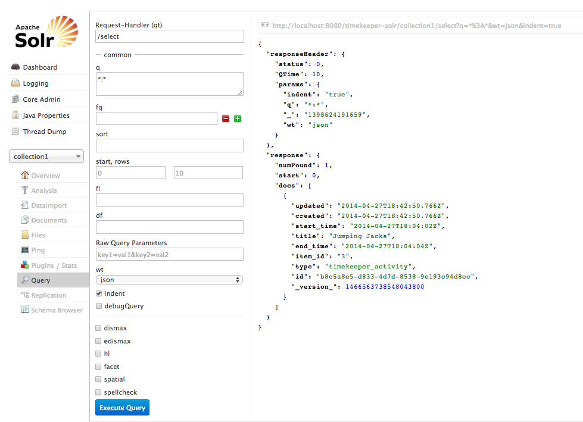

# Extended Serializers

It's time we took a closer look at serializers.

Let's imagine that I would like to display the title of the place for each activity. Currently, the only data the serializer is giving me is a URL to retrieve the place record -- not the actual data itself.

Here is a cURL request and a JSON response of an activity to illustrate:

```
$> curl -XGET -H "Accept: application/json" http://localhost:8000/activity/1/

{
    "url": "http://localhost:8000/activity/1/",
    "title": "Jogging",
    "start_time": "2014-04-26T18:10:08Z",
    "end_time": "2014-04-26T18:10:11Z",
    "place": "http://localhost:8000/place/1/",
    "partner": "http://localhost:8000/person/1/",
    "created": "2014-04-26T18:10:55.376Z",
    "updated": "2014-04-26T18:10:55.376Z"
}
```

To get the place name, we can embed a place serializer within our activity serializer. Open up `serializers/activity.py` and create a new serializer for your place data. Your file should look like this:

```
from timekeeper.models.activity import Activity
from timekeeper.models.place import Place
from rest_framework import serializers

class PlaceActivitySerializer(serializers.HyperlinkedModelSerializer):
    class Meta:
        model = Place

class ActivitySerializer(serializers.HyperlinkedModelSerializer):
    place = PlaceActivitySerializer()

    class Meta:
        model = Activity
```

Now the request for the same activity results in this:

```
{
    place: {
        url: "http://localhost:8000/place/1/",
        name: "Gym",
        latitude: null,
        longitude: null,
        created: "2014-04-26T18:10:22.523Z",
        updated: "2014-04-26T18:10:22.523Z"
    },
    url: "http://localhost:8000/activity/1/",
    title: "Jogging",
    start_time: "2014-04-26T18:10:08Z",
    end_time: "2014-04-26T18:10:11Z",
    partner: "http://localhost:8000/person/1/",
    created: "2014-04-26T18:10:55.376Z",
    updated: "2014-04-26T18:10:55.376Z"
}
```

We can now access the title of our place through the `place` field. Open your `templates/activity/activity_list.html` and add a column for the place.

```



    <table class="table">
        <thead>
            <tr>
                <th>Activity</th>
                <th>Place</th>
            </tr>
        </thead>
        <tbody>
            
            <tr>
                <td><a href="{{ activity.url }}">{{ activity.title }}</a></td>
                <td>{{ activity.place.name }}</td>
            </tr>
            
        </tbody>
    </table>

```

## Computed Fields

In our models we can define methods that can be used to process and extract information stored in that model. We have already seen a very simple example of this with the `__unicode__` method on the Person model:

```
class Person(models.Model):
    ...
    def __unicode__(self):
        return u"{0}, {1}".format(self.last_name, self.first_name)
```

In other words, a computed field is a model method that acts like a field. To illustrate, let's make computed field that can display the person's name as "Firstname Lastname":

```
@property
def full_name(self):
    return u"{0} {1}".format(self.first_name, self.last_name)
```

We can now use this in our serializer to deliver the person's full name in "natural" order:

Change your `serializers/person.py` to the following:

```
from timekeeper.models.person import Person
from rest_framework import serializers

class PersonSerializer(serializers.HyperlinkedModelSerializer):
    full_name = serializers.Field(source="full_name")

    class Meta:
        model = Person
```

Now we have a new field in our output, `full_name` which we can use to display a more natural, human-friendly version of the person's name.

```
$> curl -XGET -H "Accept: application/json" http://localhost:8000/person/1/

{
    "full_name": "Kris Kringle",
    "url": "http://localhost:8000/person/1/",
    "first_name": "Kris",
    "last_name": "Kringle",
    "created": "2014-04-26T18:10:41.077Z",
    "updated": "2014-04-26T18:10:41.077Z"
}
```

For now, we'll leave our Django web application alone and shift to looking at Solr.

# Solr

Solr is a search engine designed for fast retrieval of records. It also provides handy tools for creating faceted searching. We will be setting up Solr to use as a search engine in our TimeKeeper project.

## Getting Started

If you haven't already, you should clone the code from `https://github.com/DDMAL/solr-mvn-template` and place it in your web application folder (you should rename it to something like "solr." This will serve as a template for getting you up and running with Solr.

In there you will find a few files. These contain settings that you should customize for your own application. After changing these files you will build an instance of a Solr search system using `maven`, a build tool for Java applications, and running it through `Tomcat,` a Java web application server. We'll cover this next.

### Install prerequisites

Before we begin, you should make sure you have Tomcat and Maven installed. I find the easiest way to do this is with the `homebrew` package system on OSX, or `apt-get` on Ubuntu.

`$> brew install tomcat`
`$> brew install maven`

### Customize the package

The `pom.xml` file contains the build instructions for building a Solr instance with Maven. You should make sure you customize it to your specific project. Open it up and change the values for the following tags at the top to match your application.

 * groupId
 * artifactId
 * name
 * url

For example, here is what my the beginning of my `pom.xml` file looks like:

```
    <modelVersion>4.0.0</modelVersion>
    <groupId>ca.mcgill.music.ddmal.timekeeper</groupId>
    <artifactId>timekeeper-solr</artifactId>
    <packaging>war</packaging>
    <version>1.0-SNAPSHOT</version>
    <name>TimeKeeper Solr</name>
    <url>http://ddmal.music.mcgill.ca</url>
```

Next, look down to the `build` section and change the `finalName` tag to match what you put in the `artifactId`.

Next, let's look in the `solr` directory. There are quite a few files in `solr/collection1/conf`, but we will only look at two: `solrconfig.xml` and `schema.xml`. Open up `solrconfig.xml`.

I have had quite a few problems in the past with the value in the `dataDir` tag. Solr tries to be smart about where it stores its data, but it may not work due to permissions problems. To prevent problems I find it easiest to specify a folder on my system that Solr can read and write to.

Typically, I set the value to `/var/db/solr/` and then a sub-folder for the specific instance of solr I'm creating. So we should set the value of this to `/var/db/solr/timekeeper-solr`. You can put it where ever you like, but it should be a location that is readable and writeable by the same user that owns and runs the `tomcat` server (this varies from system to system, depending on how you have installed tomcat).

Change it and close `solrconfig.xml`.

We will focus most of our customization work on the `schema.xml` but initially we just need to change one line. Look for the `<schema name=...>` tag and change the name to something descriptive (I use the same value as the `artifactId,` 'timekeeper-solr').

Now we will try to build our Solr instance. Change to the `solr` directory in your project folder (the one with `pom.xml` in it) and run the following command:

`$> mvn package`

If this is the first time it is run, it will probably take a few minutes to download and install all the dependencies. If not, it will only take a few seconds.

After this is finished you will have a new directory, 'target'. In this directory will be a number of files, but the one we are interested in is the .war file. It will be named after the value you supplied for `finalName` in `pom.xml`

This `.war` file (for "Web Archive") is the built Solr web application, suitable for deployment with Tomcat. Any time we make a change in the `src` directory we will need to re-build this `.war` file by re-running `mvn package`.

On my system the Tomcat `webapps` directory is at `/usr/local/Cellar/tomcat/7.0.47/libexec/webapps/`. We will either need to copy our `.war` file to this, or, even better, create a symbolic link between it so that when we re-build our Solr package it will automatically be re-deployed. To symlink it, change to your tomcat webapps directory and run:

`$> ln -s /path/to/your/project/solr/target/timekeeper-solr.war .`

Now let's start up Tomcat and see if it worked. On my system I start Tomcat with the following command:

`$> catalina start`

(Similarly you can stop Tomcat with `catalina stop`)

Open a web browser and enter the URL: `http://localhost:8080/timekeeper-solr/`

If all went well, you should see something like this:


We're now ready to go!

## Understanding the Solr schema file

Open up `schema.xml` and find the `<fields>` section (This should be towards the end of the file). This section defines the fields that are present in Solr, and determine the data that we want to index.

There are several field types. All field types present in your schema must be defined above. It is possible to define new, custom fields that (for example) deal with non-English searching rules.

In general there are three different field definitions possible. The first is a regular `field`. A field defined like this might look like:

`<field name="type" type="string" indexed="true" stored="true" required="true" multiValued="false" />`

In this example, we have a field named "type", with a content type of "string". This field will be both indexed (for searching) and stored (so we can retrieve it later). These last two parameters can be handy for optimizing a search engine. For example, we can index a field, but not store it. This means that we can use it in queries, but we don't necessarily want to be able to retrieve it. The opposite, storing but not indexing, means we can store data in a Solr record but not make it available for searching.

The second field definition is a `dynamicField`. Its definition looks like this:

`<dynamicField name="*_s" type="string" indexed="true" stored="true"/>`

This looks like the regular field definition, but notice that instead of a regular field name it has a wildcard ('*') as part of the name. This means that this field will accept any fields with a name that matches the prefix, e.g., we can create a dynamic field called "first_name_s". 

Finally, the last field definition is the `copyField`. This is not a field, but rather a way of re-purposing existing fields to process them in a different manner. Consider the following definitions:

`<field name="title" type="string" indexed="true" stored="true" />`
`<field name="tg_title" type="text_general" indexed="true" />`
`<field name="tg_fr_title" type="text_fr" indexed="true" />`

In the first definition we define a field for the title that stores a book title as a "string" type. This is useful for when we want to display the book title, but not very useful if we want to do full-text search of the fields and do all the things we expect full-text searching to do -- namely, understand that words can have different endings (for plurals). This is called "stemming".

In the second definition we define a "text_general" field that provides these sorts of full-text searching tools. Note that while we index it, we are not storing it for retrieval later.

However, our 'text_general' field is defined using English grammar rules! This means that it assumes the text in the field is English, and applies the stemming rules accordingly. However, we know that the book titles we are indexing are in French, so we need another field to index this properly.

The last definition uses a "text_fr" field definition that applies proper French grammar and language rules. You can look above in your `schema.xml` file to find the exact definition of this field:

```
    <!-- French -->
    <fieldType name="text_fr" class="solr.TextField" positionIncrementGap="100">
      <analyzer> 
        <tokenizer class="solr.StandardTokenizerFactory"/>
        <!-- removes l', etc -->
        <filter class="solr.ElisionFilterFactory" ignoreCase="true" articles="lang/contractions_fr.txt"/>
        <filter class="solr.LowerCaseFilterFactory"/>
        <filter class="solr.StopFilterFactory" ignoreCase="true" words="lang/stopwords_fr.txt" format="snowball" enablePositionIncrements="true"/>
        <filter class="solr.FrenchLightStemFilterFactory"/>
        <!-- less aggressive: <filter class="solr.FrenchMinimalStemFilterFactory"/> -->
        <!-- more aggressive: <filter class="solr.SnowballPorterFilterFactory" language="French"/> -->
      </analyzer>
    </fieldType>
```

When we import our documents into Solr, we would need to load the Book title into these three fields separately. This is where `copyField` comes in handy. We can define two `copyField` directives in our `fields` section:

`<copyField source="title" dest="tg_title"/>`
`<copyField source="title" dest="tg_fr_title"/>`

The `copyField` takes a single field and copies the contents to another field so that other indexing rules may be applied to it.

Field types will store, and work, with specific types of data. For example, the "string" type will store a literal string, which makes it a useful field for faceted searches (where all records are grouped according to a string). Number fields, like "int" or "float" allows for sorting and arithmetic, while "date" fields allow for date-range searching ("Fetch records between date A and date B"). As mentioned earlier, "text" fields provide extra functionality for performing full-text searches.

## Writing a Solr Schema

So, now we have a Django database with our data stored, and a Solr instance waiting to index our data. So let's build a schema with fields to store our data.

Each document in Solr must have an unique identifier. Since we will (potentially) be loading many records in, the easiest way I have found to ensure that each record has a unique identifier is to use a Universially Unique ID (UUID). Fortunately it's very easy to generate UUIDs in Python. So, our first field will be 'id':

`<field name="id" type="string" indexed="true" stored="true" required="true" />`

While we have three Models in Django, we can't differentiate between records that easily in Solr. So we will define a field called "type" that contains one of three values that will identify our content types: "goudimel_book", "goudimel_piece" or "goudimel_phrase". Our next field will be "type".

`<field name="type" type="string" indexed="true" stored="true" />`

These two fields will be part of every record, no matter what other fields we choose to store in each document.

At this point you should add fields for every piece of data you wish to store from your Django models. As an example, here is what I have:

```
<field name="id" type="string" indexed="true" stored="true" required="true" multiValued="false" />
<field name="type" type="string" indexed="true" stored="true" required="true" multiValued="false" />
<field name="title" type="text_general" indexed="true" stored="true" />
<field name="name" type="string" indexed="true" stored="true" />
<field name="item_id" type="string" indexed="true" stored="true" />
<field name="start_time" type="date" indexed="true" stored="true"/>
<field name="end_time" type="date" indexed="true" stored="true"/>
<field name="first_name" type="string" indexed="true" stored="true" />
<field name="last_name" type="string" indexed="true" stored="true" />
<field name="created" type="date" indexed="true" stored="true"/>
<field name="updated" type="date" indexed="true" stored="true"/>
```

You may notice that we are not indexing the latitude/longitude fields on the Place model. This can be handled by the existing dynamicField definitions:

```
<!-- Type used to index the lat and lon components for the "location" FieldType -->
<dynamicField name="*_coordinate"  type="tdouble" indexed="true"  stored="false" />
<dynamicField name="*_p"  type="location" indexed="true" stored="true"/>
```

You may wish to clean up your `schema.xml` file at this point, commenting out or deleting un-used fields. Re-build your Solr instance and check to make sure it is working in Tomcat.

## Automatically Indexing Content

Now that we have a search engine up and running, we need to start adding content to it, making our data available for searching. We will be building a system to automatically index content whenever a record is created, modified, or deleted from our Django database. To do this we will make use of Django's "Signals" feature to automatically trigger indexing and updating Solr when a database record is modified.

### Signals

Django signals are an implementation of the 'notification' design pattern. This design pattern is event-driven, and can trigger multiple actions when a single message, or signal, is sent based on an action (e.g., a record is created).

When a Django model instance is saved, either when it is created or when it is edited, it will send a notification out. This notification is picked up by any methods that are registered to receive this notification.

This is useful when we want to trigger many actions (like indexing in Solr) when a record is saved, but we don't want to override the default `save()` behaviour method on that model.

### SolrPy

SolrPy is the Python module we will be using to get Django to talk to Solr. There are other, more complex modules but I find they obscure a lot of the work that Solr does in a way that makes it difficult to understand how to build a custom search system.

The first thing we need to do is create a setting in our Django application where we can store the address of our Solr server. Open up `settings.py` and add the following line:

`SOLR_SERVER = "http://localhost:8080/timekeeper-solr/"`

We will use this setting when we need to work with Solr in our indexing and querying methods.

### Indexing Content

Open up your `Activity` model file (`models/activity.py`). To start using Signals we will need to import some new methods at the top.

Import the following:

```
from django.dispatch import receiver
from django.db.models.signals import post_save
```

Now create a new function in this file. It should be its own function, and not part of the `Activity` model.

```
@receiver(post_save, sender=Activity)
def solr_index(sender, instance, created, **kwargs):
    import uuid
    from django.conf import settings
    import solr

    solrconn = solr.SolrConnection(settings.SOLR_SERVER)
    record = solrconn.query("type:timekeeper_activity item_id:{0}".format(instance.id), q_op="AND")
    if record:
        solrconn.delete(record.results[0]['id'])

    activity = instance
    d = {
        'type': 'timekeeper_activity',
        'id': str(uuid.uuid4()),
        'item_id': activity.id,
        'title': activity.title,
        'start_time': activity.start_time,
        'end_time': activity.end_time,
        'created': activity.created,
        'updated': activity.updated
    }
    solrconn.add(**d)
    solrconn.commit()
```

Let's look at this method a bit more in-depth. The first line of this function is called a Python "decorator". Decorators are handy to know about, but for now it's enough to know that this function is what "registers" the following function for notifications. Notice that the `@receiver` takes two arguments: the notification it will listen for ([post_save](https://docs.djangoproject.com/en/dev/ref/signals/#post-save)), and the specific model that it listens for notifications from (`Activity`).

This means that after an Activity record has been saved, this `solr_index` function will be called.

The `solr_index` function takes a number of parameters. The first is a reference to the sender, in this case the Activity model. The second is a reference to the specific `instance,` or record that was saved. The other arguments are optional and can be ignored for the moment.

The import lines are fairly self-explanatory. Notice that we are importing the `uuid` module to create universally unique IDs for our records.

`solrconn` is the call that establishes a connection to our Solr server. We can use the setting from our `settings.py` that we created earlier.

The next few lines will look for an existing record in our Solr system. If we are creating a new record, chances are it will not exist. However, if we are updating an older record the easiest way to deal with it is to delete the old record and then re-add a new one. By default, Solr uses an "OR" operator, so we must explicitly specify the "AND" query operator (`q_op`) for this operation.

Finally, we index the content. We create a key/value dictionary that contains the Solr field that we want to push content into, and the content from our activity instance that is being saved as the value. Notice that the keys in our dictionary match the fields that we established in our Solr schema.

This is concluded by calling `add` to our Solr server to add the document to the Solr server. It uses a Python idiom that you may not be familiar with:

`solrconn.add(**d)`

What this call does is expands the keys and values from our dictionary into arguments for the function call. So:

`d = {'title': "Jogging", "start_time": "2014-04-27T18:04:02Z"}`

becomes:

`solrconn.add(title="Jogging", start_time="2014-04-27T18:04:02Z")`

I find it a very handy thing to use.

Now that our indexing script is in place, let's test it out. Open a web browser and navigate to the Django admin interface. Add a new activity.

Once you have added it, navigate to your Solr admin interface. Select "collection1" from the drop-down on the left, and then choose the "Query" option. You can leave everything the way it is, and click the "Execute Query" button.

You should see something like this:



Success! To get your previously-added activities into Solr you just need to go in and re-save them without changing anything. They will be automatically indexed as you save.

Proceed to do the same thing for your other two models. Remember that you *will* need to change the `type` field to match the record type. I use the pattern "appname_model", so "timekeeper_activity", "timekeeper_person", etc.

### Deleting content

When a record is created or modified, the `post_save` handler will automatically update the Solr record. However, if you should delete a record you will probably want to completely remove it from your Solr index. We will use another Django signal ([post_delete](https://docs.djangoproject.com/en/dev/ref/signals/#post-delete)) for this:

```
@receiver(post_delete, sender=Activity)
def solr_delete(sender, instance, **kwargs):
    from django.conf import settings
    import solr
    solrconn = solr.SolrConnection(settings.SOLR_SERVER)
    record = solrconn.query("type:timekeeper_activity item_id:{0}".format(instance.id), q_op="AND")
    solrconn.delete(record.results[0]['id'])
    solrconn.commit()
```

Be sure to import the `post_delete` signal at the top:

`from django.db.models.signals import post_save, post_delete`

Again, do this for every one of your models, changing the field names where appropriate.

# Wrapping up

This part of the tutorial covered the following topics:

 * Serializers, and customized output
 * Modifiying our templates to display information from related models
 * Getting, building, and configuring Solr
 * Customizing the Solr schema for our application
 * Automatically indexing and deleting records from our application in Solr.

The next part of this tutorial will cover searching and retrieiving records from Solr, and tying them into our web interface.