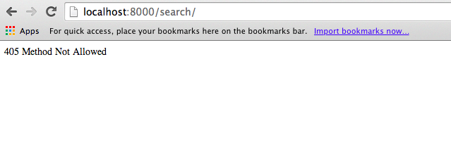

# Searching with Solr

Now that we have data in our Solr search engine, it's time to hook up the Solr interface to our front-end, and provide a search system. However, we should first think about how we want it to operate.

Our system provides methods for using both human (HTML) interfaces, as well as API-based interfaces. Our search system should provide a similar functionality. We should be able to submit a search query to our system using a URL, and retrieve a formatted list of the results.

## Setting up

Let's begin by pulling in some helper code that I've written to help manage the communication between our web application and Solr. Create a new folder in your project and call it "helpers." Don't forget to add an `__init__.py` file so that we can import from the files in it.

You can add three files in this folder from `http://github.com/DDMAL/DjangoDemoApplication/`:

 * `json_response.py`
 * `paginate.py`
 * `solrsearch.py`

What the code in these files do will become apparent later.

Next, let's create our search view and map it in our URLs file. Create a new file, `views/search.py`:

```python
from rest_framework.views import APIView
from rest_framework.response import Response
from rest_framework import status
from rest_framework.renderers import JSONRenderer, JSONPRenderer

from timekeeper.serializers.search import SearchSerializer
from timekeeper.renderers.custom_html_renderer import CustomHTMLRenderer
from timekeeper.helpers.solrsearch import SolrSearch


class SearchViewHTMLRenderer(CustomHTMLRenderer):
    template_name = "search/search.html"


class SearchView(APIView):
    serializer_class = SearchSerializer
    renderer_classes = (JSONRenderer, JSONPRenderer, SearchViewHTMLRenderer)
```

This should look familiar -- it is the same structure we created for our other views. Notice that we're using the same `CustomHTMLRenderer` helper, and we reference a few files and classes we have not created yet. We'll get to these in a moment, but first we will connect this view up in our `urls.py` file. Add a new URL mapping:

```python
from timekeeper.views.search import SearchView
...
url(r'^search/$', SearchView.as_view(), name="search-view"),
...
```

Now we can get to creating the missing code we referenced in our view. Let's create the SearchSerializer by creating a new file, `serializers/search.py` and adding the following code:

```python
from rest_framework import serializers


class SearchSerializer(serializers.Serializer):
    pass
```

This is a very simple serializer for the moment.

Next, create the templates for the HTML views. Create a new folder, `templates/search` and inside create two files, `search.html` and `search_results.html`.

In `search.html` we will create a simple search form:

```html+django




<div class="row">
    <div class="col-md-8">
        <form role="form" id="search-form" action="/search" method="get">
            <div class="form-group">
                <input class="form-control" type="text" name="q" id="search-input" />
            </div>
            <button type="submit" class="btn">Search</button>
        </form>

        
            <h3>Results</h3>
            
        
    </div>
</div>


```

Notice that this form includes the `search_results.html` template if there are any search results.

In `search_results.html` place the following template code:

```html+django

    
        <div class="row">
            <div class="search-result">
                <p>{{ result.type }} - {{ result.id }}</p>
            </div>
        </div>
    

    <h5>No Results found.</h5>

```

Notice that this isn't really very useful, since all it will do is display the type and ID of our Solr records. But, we can fix this later.

## Testing

Now that we have this set up, let's visit our new search page in our web browser. Make sure your development server is running, and then visit `http://localhost:8000/search`



Uh oh! What does this mean?

To understand what's going on here, we'll retun to our previous conversation about REST, and how the HTTP methods can be used to manage interaction between the client and the server.

It turns out that there are a lot of "hidden" methods on our previous views that we took for granted. If you have a look at your previous views, you will see that we're sub-classing a different view than the one that we're subclassing in our `SearchView` class. For example:

```python
class ActivityList(generics.ListCreateAPIView):
```

The advantage of subclassing these helper classes is that we can rely on their default behaviour for mapping an incoming request to a Python method to handle that request. In other words, if a view receives a `GET` request, it can send it off to a pre-built `get()` method on our class; a `POST` request would be sent off to a `post()` method, and so on.

Since we're writing a generic view for our `SearchView,` we have not yet supplied a method for mapping an incoming `GET` request to a method on our view. By default, the Django REST Framework will block ALL request types it is not specifically designed to handle, and will instead send back a `405` error, "Method not allowed."

To fix this, let's add a very simple `get` method to our `SearchView`:

```python
    def get(self, request, *args, **kwargs):
        return Response({})
```

Now, let's load our search page:


That's better!

If you type something in to your search field and press the search button, you won't see anything spectacular. However, you should notice that the URL in your browser changes slightly. If I type "jogging" into the search field and click "search", my URL changes to this:

`http://localhost:8000/search/?q=jogging`

We can use this to start passing on search terms to Solr.

## Performing Searches

To start performing searches on our data, we'll need to modify the behaviour of our `get` method to pass parameters on to Solr, and to manage the results. Change your `SearchView` `get` method to the following:

```python
    def get(self, request, *args, **kwargs):
        querydict = request.GET
        if not querydict:
            return Response({'results': []})

        s = SolrSearch(request)

        search_results = s.search()
        result = {'results': search_results}
        response = Response(result)
        return response
```

There's a lot of stuff here, so let's go through this statement-by-statement.

`querydict = request.GET`

The `request` object contains all information about the request being sent to the server, including any query parameters passed along with a GET request. These are stored in a key/value dictionary which you can retrieve using the `GET` property.

```python
if not querydict:
    return Response({'results': []})
```

This statement defines the behaviour of the page if there are no query parameters, i.e., the user is just visiting the search page, and not actually performing a search. This statement sends a `Response` object back with an empty `results` object, which our template knows how to render.

`s = SolrSearch(request)`

This is a big one. Remember the file we created previously, `helpers/solrsearch.py`? This is a helper method for performing a search against a Solr server. Open this file and have a look at the `SolrSearch` class.

When this class is initialized it takes a `request` object and parses out the query strings (L67) from the request. Query strings are everything that comes after a `?` in a URL. Initializing this class with the request method parses the request an prepares it for executing a search.

`s.search()`

This executes the search, using the query parameters. We can modify the behaviour of this search by passing in optional parameters, but for now we'll use the default behaviour.

`result = {'results': search_results}`

This creates a 'results' dictionary that contains the search results. This is in preparation for sending it back to the template layer to be rendered.

```python
response = Response(result)
return response
```

Finally we wrap the search results in a `Response` object and send it back to the client.

To test our query system, you can place an asterisk ('wildcard') in the search field and it should retrieve all of the records you have indexed in Solr. We have the beginnings of our search interface!

Let's also try this on our command-line cURL interface:

```bash
$> curl -XGET -H "Accept: application/json" "http://localhost:8000/search/?q=*"
{
    "results": [
        {
            "updated": "2014-04-27T18:42:50.766Z",
            "title": "Jumping Jacks",
            "start_time": "2014-04-27T18:04:02Z",
            "created": "2014-04-27T18:42:50.766Z",
            "score": 1.0,
            "end_time": "2014-04-27T18:04:04Z",
            "item_id": "3",
            "_version_": 1466563738548043776,
            "type": "timekeeper_activity",
            "id": "b8c5a8e5-d833-4d7d-8538-9e193c94d8ec"
        }
    ]
}
```

Looks good! Notice that this is a record for a `timekeeper_activity` object, with an ID #3. All of the fields are being retrieved, though.

## Customizing the search fields

Try searching for a term that you know exists in your database -- like "jogging" as an activity field. Notice that your query actually fails to retrieve any of the results! Why is that?

To understand why, let's return to the `solrconfig.xml` file in our Solr search server. Find the line in this file that defines the "/select" requestHandler object. This section configures the default query behaviour for Solr.

In my system, it looks like this:

```xml
  <requestHandler name="/select" class="solr.SearchHandler">
    <!-- default values for query parameters can be specified, these
         will be overridden by parameters in the request
      -->
     <lst name="defaults">
       <str name="echoParams">explicit</str>
       <int name="rows">10</int>
       <str name="df">text</str>
     </lst>
  </requestHandler>
```

Notice the `<str name="df">text</str>` line. This line configures the default fields for searching. In this case, we have only one field, `text`. We could change this to any other schema field we like, but there is actually a better way to do this.

Let's now return to our `schema.xml` file. Find the line that defines this field:

```xml
<field name="text" type="text_general" indexed="true" stored="false" multiValued="true"/>
```

This field type is `text_general`, which means that there are several processes being applied to the content of this field in order to make it available for search. To see which processes are being applied to it, you can look up the definition for the `text_general` field in the `schema.xml` file:

```xml
<!-- A general text field that has reasonable, generic
         cross-language defaults: it tokenizes with StandardTokenizer,
     removes stop words from case-insensitive "stopwords.txt"
     (empty by default), and down cases.  At query time only, it
     also applies synonyms. -->
<fieldType name="text_general" class="solr.TextField" positionIncrementGap="100">
  <analyzer type="index">
    <tokenizer class="solr.StandardTokenizerFactory"/>
    <filter class="solr.StopFilterFactory" ignoreCase="true" words="stopwords.txt" />
    <!-- in this example, we will only use synonyms at query time
    <filter class="solr.SynonymFilterFactory" synonyms="index_synonyms.txt" ignoreCase="true" expand="false"/>
    -->
    <filter class="solr.LowerCaseFilterFactory"/>
  </analyzer>
  <analyzer type="query">
    <tokenizer class="solr.StandardTokenizerFactory"/>
    <filter class="solr.StopFilterFactory" ignoreCase="true" words="stopwords.txt" />
    <filter class="solr.SynonymFilterFactory" synonyms="synonyms.txt" ignoreCase="true" expand="true"/>
    <filter class="solr.LowerCaseFilterFactory"/>
  </analyzer>
</fieldType>
```

So, to search on all our records we will need to copy the data from our dedicated schema fields into the text field. We could do this manually, but Solr comes with a special field type, the `copyField` that does this for us automatically. To use it, we simply define which fields we want to copy into the `text` fields.

Like this:

```xml
<copyField source="first_name" dest="text" />
<copyField source="last_name" dest="text" />
<copyField source="name" dest="text" />
<copyField source="title" dest="text" />
```

Save, and re-build your Solr installation. Once that's done, try searching for anything: an activity name, a last name or a first name, or a place title. You should be able to retrieve all of these records.

## Theming our results.

So far we can retrieve the records from our Solr server, but they look pretty bad -- they don't have any indication of what they are, or any information along with them. So, let's tidy them up a bit.

Open up your templates `search/search_results.html` file. You can check out the various styles and tools for use in the Bootstrap documentation. Here's what mine looks like:

```html+django

    <div class="list-group">
    
        
            <a href="/activity/{{ result.item_id }}" class="list-group-item">
                <span class="label label-primary pull-right">Activity</span>
                <h4>{{ result.title }}</h4>
                <p class="list-group-item-text">Started: {{ result.start_time }} Ended: {{ result.end_time }}</p>
            </a>
        
            <a href="/place/{{ result.item_id }}" class="list-group-item">
                <span class="label label-success pull-right">Place</span>
                <h4>{{ result.name }}</h4>
                <p class="list-group-item-text">Location: {{ result.latitude_coordinates }}, {{ result.longitude_coordinates }} </p>
            </a>
        
            <a href="/person/{{ result.item_id }}" class="list-group-item">
                <span class="label label-info pull-right">Person</span>
                <h4>{{ result.last_name }}, {{ result.first_name }}</h4>
                <p class="list-group-item-text"></p>
            </a>
        
    
    </div>

    <h5>No Results found.</h5>

```

This is a nice beginning.

## Faceted Searching

You may have used facets before when browsing a website like Amazon or Kijiji. Categories, or features, of the things you are looking for appear on the side, and you can select them and execute a query on the system, retrieving only books in the "Kittens" category, or something like that.

One of the nicest things about Solr is that it does most of the work for viewing faceted results for "free," allowing you to build a faceted browsing system fairly easily. Let's add a one to our TimeKeeper application.

First, we need to slightly modify our `SearchView` view to include a faceted query search. Change the `get` method to add a few lines:

```python
    def get(self, request, *args, **kwargs):
        querydict = request.GET

        s = SolrSearch(request)
        facets = s.facets(['name', 'title', 'last_name'])

        if not querydict:
            return Response({'results': [], 'facets': facets.facet_counts})

        search_results = s.search()
        result = {'results': search_results, 'facets': facets.facet_counts}
        response = Response(result)
        return response
```

A couple things to notice here. We've slightly re-arranged the order of execution, so that the system will initialize the search before returning an empty response. This is because we want the search page to display a list of all facets by default, so that the user can use this as a browse interface.

The facets we are including in this search are on the name, title, and last_name field. Any string-based field can be used as a faceted field.

Let's look at the response we get from the search system now, by using our cURL interface. First, an empty search:

```bash
$> curl -XGET -H "Accept: application/json" "http://localhost:8000/search/"
{
    "facets": 
    {
        "facet_ranges": {},
        "facet_fields":
        {
            "last_name":
            {
                "Kringle": 1,
                "Doe": 1
            },
            "name":
            {
                "Home": 1,
                "Gym": 1
            },
            "title":
            {
                "mailing": 1,
                "jogging": 1,
                "jumping": 1,
                "e": 1,
                "jacks": 1
            }
        },
        "facet_dates": {},
        "facet_queries": {}},
    "results": []
}
```

This looks mostly OK. You can see that we have a number of facet fields returned, with the value of the field, and the number of documents (1, in this case) for each document. We'll see how to use this in a later section, but before we do, notice what's happening with the "title" facet field. It's not at all what we thought we were indexing -- it's split "e" and "mailing" (from "E-mailing"), and has lower-cased everything. This won't make for a very good search facet!

Luckily, fixing it is pretty easy. Return to your Solr `schema.xml` and find your `title` field. Change the type from `text_general` to `string`, save, and re-build Solr. Then go in your Django admin interface and re-save all of your activity models. Now the same search returns something a bit more useful:

```bash
$> curl -XGET -H "Accept: application/json" "http://localhost:8000/search/"
{
    "facets": 
    {
        "facet_ranges": {},
        "facet_fields":
        {
            "last_name":
            {
                "Kringle": 1,
                "Doe": 1
            },
            "name":
            {
                "Home": 1,
                "Gym": 1
            },
            "title":
            {
                "E-mailing": 1,
                "Jumping Jacks": 1,
                "Jogging": 1
            }
        },
        "facet_dates": {},
        "facet_queries": {}},
    "results": []
}
```

So, now we are retrieving data from our Solr search system. We should make this usable in the HTML interface.

## Theming Facets

We will be displaying our faceted browser in a sidebar on our search page. Open up your `templates/search/search.html`.


