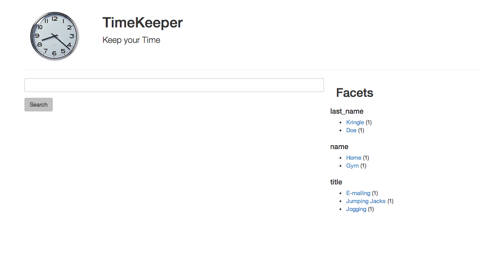
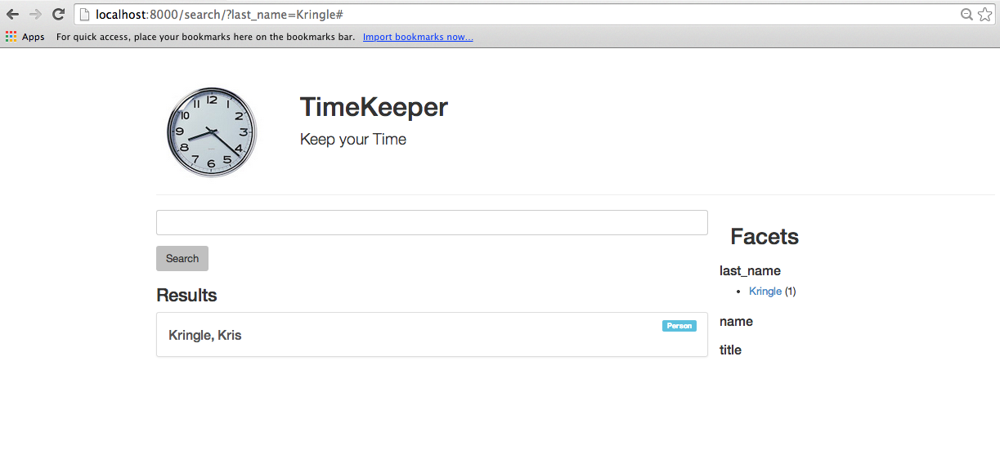

# Solr

Solr is a search engine designed for fast retrieval of records. It also provides handy tools for creating faceted searching. We will be setting up Solr to use as a search engine in our TimeKeeper project.

## Getting Started

If you haven't already, you should clone the code from `https://github.com/DDMAL/solr-mvn-template` and place it in your web application folder (you should rename it to something like "solr." This will serve as a template for getting you up and running with Solr.

In there you will find a few files. These contain settings that you should customize for your own application. After changing these files you will build an instance of a Solr search system using `maven`, a build tool for Java applications, and running it through `Tomcat,` a Java web application server. We'll cover this next.

### Install prerequisites

Before we begin, you should make sure you have Maven installed. I find the easiest way to do this is with the `homebrew` package system on OSX, or `apt-get` on Ubuntu.

`$> brew install maven`

### Customize the package

The `pom.xml` file contains the build instructions for building a Solr instance with Maven. You should make sure you customize it to your specific project. Open it up and change the values for the following tags at the top to match your application.

 * groupId
 * artifactId
 * name
 * url

For example, here is what my the beginning of my `pom.xml` file looks like:

```
    <modelVersion>4.0.0</modelVersion>
    <groupId>ca.mcgill.music.ddmal.codekeeper</groupId>
    <artifactId>codekeeper-solr</artifactId>
    <packaging>war</packaging>
    <version>1.0-SNAPSHOT</version>
    <name>CodeKeeper Solr</name>
    <url>http://ddmal.music.mcgill.ca</url>
```

Next, look down to the `build` section and change the `finalName` tag to match what you put in the `artifactId`.

Next, let's look in the `solr` directory. There are quite a few files in `solr/collection1/conf`, but we will only look at one right now: `schema.xml`.

We will do more customization work in `schema.xml` but for right now we just need to change one line. Look for the `<schema name=...>` tag and change the name to something descriptive (I use the same value as the `artifactId,` 'codekeeper-solr').

Now we will try to build our Solr instance. Change to the `solr` directory in your project folder (the one with `pom.xml` in it) and run the following command:

    $> mvn package

If this is the first time it is run, it will probably take a few minutes to download and install all the dependencies. If not, it will only take a few seconds.

After this is finished you will have a new directory, 'target'. In this directory will be a number of files, but the one we are interested in is the .war file. It will be named after the value you supplied for `finalName` in `pom.xml`

This `.war` file (for "Web Archive") is the built Solr web application, suitable for deployment with a Java application server such as Tomcat. However, this version of Solr comes with a built-in web server we can use for testing, `jetty`. You can quickly boot up your copy of Solr and start testing it by running:

    $> mvn jetty:run

You should see lots of text fly by, and then a line like:

    [INFO] Started Jetty Server

Scroll back through the console output to make sure there are no errors, and then visit your Solr instance in your web browser. If all went well, you should see something like this:


We're now ready to go!

## Understanding the Solr schema file

Open up `schema.xml` and find the `<fields>` section (This should be towards the end of the file). This section defines the fields that are present in Solr, and determine the data that we want to index.

There are several field types. All field types present in your schema must be defined above. It is possible to define new, custom fields that (for example) deal with non-English searching rules.

In general there are three different field definitions possible. The first is a regular `field`. A field defined like this might look like:

`<field name="type" type="string" indexed="true" stored="true" required="true" multiValued="false" />`

In this example, we have a field named "type", with a content type of "string". This field will be both indexed (for searching) and stored (so we can retrieve it later). These last two parameters can be handy for optimizing a search engine. For example, we can index a field, but not store it. This means that we can use it in queries, but we don't necessarily want to be able to retrieve it. The opposite, storing but not indexing, means we can store data in a Solr record but not make it available for searching.

The second field definition is a `dynamicField`. Its definition looks like this:

`<dynamicField name="*_s" type="string" indexed="true" stored="true"/>`

This looks like the regular field definition, but notice that instead of a regular field name it has a wildcard ('*') as part of the name. This means that this field will accept any fields with a name that matches the prefix, e.g., we can create a dynamic field called "first_name_s". 

Finally, the last field definition is the `copyField`. This is not a field, but rather a way of re-purposing existing fields to process them in a different manner. Consider the following definitions:

`<field name="title" type="string" indexed="true" stored="true" />`
`<field name="tg_title" type="text_general" indexed="true" />`
`<field name="tg_fr_title" type="text_fr" indexed="true" />`

In the first definition we define a field for the title that stores a book title as a "string" type. This is useful for when we want to display the book title, but not very useful if we want to do full-text search of the fields and do all the things we expect full-text searching to do -- namely, understand that words can have different endings (for plurals). This is called "stemming".

In the second definition we define a "text_general" field that provides these sorts of full-text searching tools. Note that while we index it, we are not storing it for retrieval later.

However, our 'text_general' field is defined using English grammar rules! This means that it assumes the text in the field is English, and applies the stemming rules accordingly. However, we know that the book titles we are indexing are in French, so we need another field to index this properly.

The last definition uses a "text_fr" field definition that applies proper French grammar and language rules. You can look above in your `schema.xml` file to find the exact definition of this field:

```
    <!-- French -->
    <fieldType name="text_fr" class="solr.TextField" positionIncrementGap="100">
      <analyzer> 
        <tokenizer class="solr.StandardTokenizerFactory"/>
        <!-- removes l', etc -->
        <filter class="solr.ElisionFilterFactory" ignoreCase="true" articles="lang/contractions_fr.txt"/>
        <filter class="solr.LowerCaseFilterFactory"/>
        <filter class="solr.StopFilterFactory" ignoreCase="true" words="lang/stopwords_fr.txt" format="snowball" enablePositionIncrements="true"/>
        <filter class="solr.FrenchLightStemFilterFactory"/>
        <!-- less aggressive: <filter class="solr.FrenchMinimalStemFilterFactory"/> -->
        <!-- more aggressive: <filter class="solr.SnowballPorterFilterFactory" language="French"/> -->
      </analyzer>
    </fieldType>
```

When we import our documents into Solr, we would need to load the Snippet title into these three fields separately. This is where `copyField` comes in handy. We can define two `copyField` directives in our `fields` section:

`<copyField source="title" dest="tg_title"/>`
`<copyField source="title" dest="tg_fr_title"/>`

The `copyField` takes a single field and copies the contents to another field so that other indexing rules may be applied to it.

Field types will store, and work, with specific types of data. For example, the "string" type will store a literal string, which makes it a useful field for faceted searches (where all records are grouped according to a string). Number fields, like "int" or "float" allows for sorting and arithmetic, while "date" fields allow for date-range searching ("Fetch records between date A and date B"). As mentioned earlier, "text" fields provide extra functionality for performing full-text searches.

## Writing a Solr Schema

So, now we have a Django database with our data stored, and a Solr instance waiting to index our data. So let's build a schema with fields to store our data.

Each document in Solr must have an unique identifier. Since we will (potentially) be loading many records in, the easiest way I have found to ensure that each record has a unique identifier is to use a Universially Unique ID (UUID). Fortunately it's very easy to generate UUIDs in Python. So, our first field will be 'id':

`<field name="id" type="string" indexed="true" stored="true" required="true" />`

While we have three Models in Django, we can't differentiate between records that easily in Solr. So we will define a field called "type" that contains one of three values that will identify our content types: "goudimel_book", "goudimel_piece" or "goudimel_phrase". Our next field will be "type".

`<field name="type" type="string" indexed="true" stored="true" />`

These two fields will be part of every record, no matter what other fields we choose to store in each document.

At this point you should add fields for every piece of data you wish to store from your Django models. As an example, here is what I have:

```
    <field name="id" type="string" indexed="true" stored="true" required="true" multiValued="false" />
    <field name="type" type="string" indexed="true" stored="true" required="true" multiValued="false" />
    <field name="item_id" type="int" indexed="true" stored="false" />
    <field name="title" type="string" indexed="true" stored="true" />
    <field name="name" type="string" indexed="true" stored="true" />
    <field name="first_name" type="string" indexed="true" stored="true" />
    <field name="last_name" type="string" indexed="true" stored="true" />
    <field name="snippet" type="string" indexed="true" stored="true" />
    <field name="tags" type="string" indexed="true" stored="true" multiValued="true" />
    <field name="created" type="date" indexed="true" stored="true"/>
    <field name="updated" type="date" indexed="true" stored="true"/>
```

You may wish to clean up your `schema.xml` file at this point, commenting out or deleting un-used fields. Re-build your Solr instance and check to make sure it is working in Tomcat. For now, that's all there is to it to get Solr up and running.

## Automatically Indexing Content

Now that we have a search engine up and running, we need to start adding content to it, making our data available for searching. We will be building a system to automatically index content whenever a record is created, modified, or deleted from our Django database. To do this we will make use of Django's "Signals" feature to automatically trigger indexing and updating Solr when a database record is modified.

### Signals

Django signals are an implementation of the 'notification' design pattern. This design pattern is event-driven, and can trigger multiple actions when a single message, or signal, is sent based on an action (e.g., a record is created).

When a Django model instance is saved, either when it is created or when it is edited, it will send a notification out. This notification is picked up by any methods that are registered to receive this notification.

This is useful when we want to trigger many actions (like indexing in Solr) when a record is saved, but we don't want to override the default `save()` behaviour method on that model.

### Scorched

`Scorched` is the Python module we will be using to get Django to talk to Solr. There are other, more complex modules but I find they obscure a lot of the work that Solr does in a way that makes it difficult to understand how to build a custom search system.

The first thing we need to do is create a setting in our Django application where we can store the address of our Solr server. Open up `settings.py` and add the following line:

`SOLR_SERVER = "http://localhost:8080/codekeeper-solr/"`

We will use this setting when we need to work with Solr in our indexing and querying methods.

### Indexing Content

Open up your `Snippet` model file (`models/snippet.py`). To start using Signals we will need to import some new methods at the top.

Import the following:

```
from django.dispatch import receiver
from django.db.models.signals import post_save
```

Now create a new function in this file. It should be its own function, and not part of the `Snippet` model.

```
@receiver(post_save, sender=Snippet)
def solr_index(sender, instance, created, **kwargs):
    import uuid
    from django.conf import settings
    import scorched

    solrconn = scorched.SolrInterface(settings.SOLR_SERVER)

    # check to see if any records with this type and id already exist in Solr (i.e., we're updating a record)
    records = solrconn.query(type="snippet", item_id="{0}".format(instance.pk)).execute()
    if records:
        # if it exists, delete it before re-adding it.
        solrconn.delete_by_ids([x['id'] for x in records])

    d = {
        'id': str(uuid.uuid4()),
        'type': 'snippet',
        'item_id': instance.pk,
        'snippet': instance.snippet,
        'title': instance.title
    }

    solrconn.add(d)
    solrconn.commit()
```

Let's look at this method a bit more in-depth. The first line of this function, starting with an "@" sign, is called a Python "decorator". Decorators are handy to know about, but for now it's enough to know that this is what "registers" the `solr_index` function for notifications. Notice that the `@receiver` takes two arguments: the notification it will listen for ([post_save](https://docs.djangoproject.com/en/dev/ref/signals/#post-save)), and the specific model that it listens for notifications from (`Snippet`).

This means that after an Snippet record has been saved, this `solr_index` function will be called.

The `solr_index` function takes a number of parameters. The first is a reference to the sender, in this case the Snippet model. The second is a reference to the specific `instance,` or record that was saved. The other arguments are optional and can be ignored for the moment.

The import lines are fairly self-explanatory. Notice that we are importing the `uuid` module to create universally unique IDs for our records.

`solrconn` is the call that establishes a connection to our Solr server. We can use the setting from our `settings.py` that we created earlier.

The next few lines will look for an existing record in our Solr system. If we are creating a new record, chances are it will not exist. However, if we are updating an older record the easiest way to deal with it is to delete the old record and then re-add a new one.

Finally, we index the content. We create a key/value dictionary that contains the Solr field that we want to push content into, and the content from our activity instance that is being saved as the value. Notice that the keys in our dictionary match the fields that we established in our Solr schema.

This is concluded by calling `add` to our Solr server to add the document to the Solr server, and then a `commit()` call.

Now that our indexing script is in place, let's test it out. Make sure your Django server is still running, open a web browser and navigate to the Django admin interface. Add a new snippet.

Once you have added it, navigate to your Solr admin interface. Select "collection1" from the drop-down on the left, and then choose the "Query" option. You can leave everything the way it is, and click the "Execute Query" button.

You should see something like this:


Success! To get your previously-added snippets into Solr you just need to go in and re-save them without changing anything. They will be automatically indexed as you save.

Proceed to do the same thing for your other two models. Remember that you *will* need to change the `type` field to match the record type.

### Deleting content

When a record is created or modified, the `post_save` handler will automatically update the Solr record. However, if you should delete a record you will probably want to completely remove it from your Solr index. We will use another Django signal ([post_delete](https://docs.djangoproject.com/en/dev/ref/signals/#post-delete)) for this:

```
@receiver(post_delete, sender=Snippet)
def solr_index(sender, instance, created, **kwargs):
    from django.conf import settings
    import scorched

    solrconn = scorched.SolrInterface(settings.SOLR_SERVER)
    records = solrconn.query(type="snippet", item_id="{0}".format(instance.pk)).execute()
    solrconn.delete_by_ids([x['id'] for x in records])
    solrconn.commit()
```

Be sure to import the `post_delete` signal at the top:

`from django.db.models.signals import post_save, post_delete`

Again, do this for every one of your models, changing the field names where appropriate.

### Multifaceted Tags

Remember that our `tags` field is a Many-to-many relationship? If you were sharp, you would have seen that, when we defined the Solr fields above, we put in the following definition for the `tags` field:

    <field name="tags" type="string" indexed="true" stored="true" multiValued="true" />

The `multiValued="true"` parameter specifies that this particular field can accept multiple values; in our case, a list of tags, where each tag is a string.

To index this, however, we need to grab the tag names from our many-to-many relationship prior to sending them to Solr. We can do this by adding a small list comprehension to build an array of tag names on the field in our indexing code:

    ...
    'tags': [tag.name for tag in instance.tags.all()],
    ...

# Wrapping up

This part of the tutorial covered the following topics:

 * Serializers, and customized output
 * Modifiying our templates to display information from related models
 * Getting, building, and configuring Solr
 * Customizing the Solr schema for our application
 * Automatically indexing and deleting records from our application in Solr.

The next part of this tutorial will cover searching and retrieiving records from Solr, and tying them into our web interface.

# Searching with Solr

Now that we have data in our Solr search engine, it's time to hook up the Solr interface to our front-end, and provide a search system. However, we should first think about how we want it to operate.

Our system provides methods for using both human (HTML) interfaces, as well as API-based interfaces. Our search system should provide a similar functionality. We should be able to submit a search query to our system using a URL, and retrieve a formatted list of the results.

## Setting up

Let's begin by pulling in some helper code that I've written to help manage the communication between our web application and Solr. Create a new folder in your project and call it "helpers." Don't forget to add an `__init__.py` file so that we can import from the files in it.

You can add three files in this folder from `http://github.com/DDMAL/DjangoDemoApplication/`:

 * `json_response.py`
 * `paginate.py`
 * `solrsearch.py`

What the code in these files do will become apparent later.

Next, let's create our search view and map it in our URLs file. Create a new file, `views/search.py`:

```python
from rest_framework.generics import GenericAPIView
from rest_framework.response import Response
from rest_framework import status
from rest_framework.renderers import JSONRenderer

from codekeeper.serializers.search import SearchSerializer
from codekeeper.renderers.custom_html_renderer import CustomHTMLRenderer

class SearchViewHTMLRenderer(CustomHTMLRenderer):
    template_name = "search/search.html"


class SearchView(GenericAPIView):
    serializer_class = SearchSerializer
    renderer_classes = (JSONRenderer, SearchViewHTMLRenderer)
```

This should look familiar -- it is the same structure we created for our other views. Notice that we're using the same `CustomHTMLRenderer` helper, and we reference a few files and classes we have not created yet. We'll get to these in a moment, but first we will connect this view up in our `urls.py` file. Add a new URL mapping:

```python
from codekeeper.views.search import SearchView
...
url(r'^search/$', SearchView.as_view(), name="search-view"),
...
```

Now we can get to creating the missing code we referenced in our view. Let's create the SearchSerializer by creating a new file, `serializers/search.py` and adding the following code:

```python
from rest_framework import serializers


class SearchSerializer(serializers.Serializer):
    pass
```

This is a very simple serializer for the moment.

Next, create the templates for the HTML views. Create a new folder, `templates/search` and inside create two files, `search.html` and `search_results.html`.

In `search.html` we will create a simple search form:

```html+django




<div class="row">
    <div class="col-md-8">
        <form role="form" id="search-form" action="/search" method="get">
            <div class="form-group">
                <input class="form-control" type="text" name="q" id="search-input" />
            </div>
            <button type="submit" class="btn">Search</button>
        </form>

        
            <h3>Results</h3>
            
        
    </div>
</div>


```

Notice that this form includes the `search_results.html` template if there are any search results.

In `search_results.html` place the following template code:

```html+django

    
        <div class="row">
            <div class="search-result">
                <p>{{ result.type }} - {{ result.id }}</p>
            </div>
        </div>
    

    <h5>No Results found.</h5>

```

Notice that this isn't really very useful, since all it will do is display the type and ID of our Solr records. But, we can fix this later.

## Testing

Now that we have this set up, let's visit our new search page in our web browser. Make sure your development server is running, and then visit `http://localhost:8000/search`


Uh oh! What does this mean?

To understand what's going on here, we'll retun to our previous conversation about REST, and how the HTTP methods can be used to manage interaction between the client and the server.

It turns out that there are a lot of "hidden" methods in our other views that we took for granted. If you have a look at your previous views, you will see that we're sub-classing a different view than the one that we're subclassing in our `SearchView` class. For example:

```python
class SnippetList(generics.ListCreateAPIView):
```

The advantage of subclassing these helper classes is that we can rely on their default behaviour for mapping an incoming request to a Python method to handle that request. In other words, if a view receives a `GET` request, it can send it off to a pre-built `get()` method on our class; a `POST` request would be sent off to a `post()` method, and so on.

Since we're writing a generic view for our `SearchView,` we have not yet supplied a method for mapping an incoming `GET` request to a method on our view. By default, the Django REST Framework will block ALL request types it is not specifically designed to handle, and will instead send back a `405` error, "Method not allowed."

To fix this, let's add a very simple `get` method to our `SearchView`:

```python
    def get(self, request, *args, **kwargs):
        return Response({})
```

Now, let's load our search page:


That's better!

If you type something in to your search field and press the search button, you won't see anything spectacular. However, you should notice that the URL in your browser changes slightly. If I type "python" into the search field and click "search", my URL changes to this:

`http://localhost:8000/search/?q=python`

We can use this to start passing on search terms to Solr.

## Performing Searches

To start performing searches on our data, we'll need to modify the behaviour of our `get` method to pass parameters on to Solr, and to manage the results. Change your `SearchView` `get` method to the following:

```python
    def get(self, request, *args, **kwargs):
        querydict = request.GET
        if not querydict:
            return Response({"results": []})

        solrconn = scorched.SolrInterface(settings.SOLR_SERVER)
        resp = solrconn.query(title=querydict.get('q')).execute()
        records = [r for r in resp]
        s = self.get_serializer(records, many=True)
        return Response(s.data)
```

There's a lot of stuff here, so let's go through this statement-by-statement.

`querydict = request.GET`

The `request` object contains all information about the request being sent to the server, including any query parameters passed along with a GET request. These are stored in a key/value dictionary which you can retrieve using the `GET` property.

```python
if not querydict:
    return Response({'results': []})
```

This statement defines the behaviour of the page if there are no query parameters, i.e., the user is just visiting the search page, and not actually performing a search. This statement sends a `Response` object back with an empty `results` object, which our template knows how to render.

`s = SolrSearch(request)`

This is a big one. Remember the file we created previously, `helpers/solrsearch.py`? This is a helper method for performing a search against a Solr server. Open this file and have a look at the `SolrSearch` class.

When this class is initialized it takes a `request` object and parses out the query strings (L67) from the request. Query strings are everything that comes after a `?` in a URL. Initializing this class with the request method parses the request and prepares it for executing a search.

`s.search()`

This executes the search, using the query parameters. We can modify the behaviour of this search by passing in optional parameters, but for now we'll use the default behaviour.

`result = {'results': search_results}`

This creates a 'results' dictionary that contains the search results. This is in preparation for sending it back to the template layer to be rendered.

```python
response = Response(result)
return response
```

Finally we wrap the search results in a `Response` object and send it back to the client.

To test our query system, you can place an asterisk ('wildcard') in the search field and it should retrieve all of the records you have indexed in Solr. We have the beginnings of our search interface!

Let's also try this on our command-line cURL interface:

```bash
$> curl -XGET -H "Accept: application/json" "http://localhost:8000/search/?q=*"
{
    "results": [
        {
            "updated": "2014-04-27T18:42:50.766Z",
            "title": "Jumping Jacks",
            "start_time": "2014-04-27T18:04:02Z",
            "created": "2014-04-27T18:42:50.766Z",
            "score": 1.0,
            "end_time": "2014-04-27T18:04:04Z",
            "item_id": "3",
            "_version_": 1466563738548043776,
            "type": "timekeeper_activity",
            "id": "b8c5a8e5-d833-4d7d-8538-9e193c94d8ec"
        }
    ]
}
```

Looks good! Notice that this is a record for a `timekeeper_activity` object, with an ID #3. All of the fields are being retrieved, though.

## Customizing the search fields

Try searching for a term that you know exists in your database -- like "jogging" as an activity field. Notice that your query actually fails to retrieve any of the results! Why is that?

To understand why, let's return to the `solrconfig.xml` file in our Solr search server. Find the line in this file that defines the "/select" requestHandler object. This section configures the default query behaviour for Solr.

In my system, it looks like this:

```xml
  <requestHandler name="/select" class="solr.SearchHandler">
    <!-- default values for query parameters can be specified, these
         will be overridden by parameters in the request
      -->
     <lst name="defaults">
       <str name="echoParams">explicit</str>
       <int name="rows">10</int>
       <str name="df">text</str>
     </lst>
  </requestHandler>
```

Notice the `<str name="df">text</str>` line. This line configures the default fields for searching. In this case, we have only one field, `text`. We could change this to any other schema field we like, but there is actually a better way to do this.

Let's now return to our `schema.xml` file. Find the line that defines this field:

```xml
<field name="text" type="text_general" indexed="true" stored="false" multiValued="true"/>
```

This field type is `text_general`, which means that there are several processes being applied to the content of this field in order to make it available for search. To see which processes are being applied to it, you can look up the definition for the `text_general` field in the `schema.xml` file:

```xml
<!-- A general text field that has reasonable, generic
         cross-language defaults: it tokenizes with StandardTokenizer,
     removes stop words from case-insensitive "stopwords.txt"
     (empty by default), and down cases.  At query time only, it
     also applies synonyms. -->
<fieldType name="text_general" class="solr.TextField" positionIncrementGap="100">
  <analyzer type="index">
    <tokenizer class="solr.StandardTokenizerFactory"/>
    <filter class="solr.StopFilterFactory" ignoreCase="true" words="stopwords.txt" />
    <!-- in this example, we will only use synonyms at query time
    <filter class="solr.SynonymFilterFactory" synonyms="index_synonyms.txt" ignoreCase="true" expand="false"/>
    -->
    <filter class="solr.LowerCaseFilterFactory"/>
  </analyzer>
  <analyzer type="query">
    <tokenizer class="solr.StandardTokenizerFactory"/>
    <filter class="solr.StopFilterFactory" ignoreCase="true" words="stopwords.txt" />
    <filter class="solr.SynonymFilterFactory" synonyms="synonyms.txt" ignoreCase="true" expand="true"/>
    <filter class="solr.LowerCaseFilterFactory"/>
  </analyzer>
</fieldType>
```

So, to search on all our records we will need to copy the data from our dedicated schema fields into the text field. We could do this manually, but Solr comes with a special field type, the `copyField` that does this for us automatically. To use it, we simply define which fields we want to copy into the `text` fields.

Like this:

```xml
<copyField source="first_name" dest="text" />
<copyField source="last_name" dest="text" />
<copyField source="name" dest="text" />
<copyField source="title" dest="text" />
```

Save, and re-build your Solr installation. Once that's done, try searching for anything: an activity name, a last name or a first name, or a place title. You should be able to retrieve all of these records.

## Theming our results.

So far we can retrieve the records from our Solr server, but they look pretty bad -- they don't have any indication of what they are, or any information along with them. So, let's tidy them up a bit.

Open up your templates `search/search_results.html` file. You can check out the various styles and tools for use in the Bootstrap documentation. Here's what mine looks like:

```html+django

    <div class="list-group">
    
        
            <a href="/activity/{{ result.item_id }}" class="list-group-item">
                <span class="label label-primary pull-right">Activity</span>
                <h4>{{ result.title }}</h4>
                <p class="list-group-item-text">Started: {{ result.start_time }} Ended: {{ result.end_time }}</p>
            </a>
        
            <a href="/place/{{ result.item_id }}" class="list-group-item">
                <span class="label label-success pull-right">Place</span>
                <h4>{{ result.name }}</h4>
                <p class="list-group-item-text">Location: {{ result.latitude_coordinate }}, {{ result.longitude_coordinate }} </p>
            </a>
        
            <a href="/person/{{ result.item_id }}" class="list-group-item">
                <span class="label label-info pull-right">Person</span>
                <h4>{{ result.last_name }}, {{ result.first_name }}</h4>
                <p class="list-group-item-text"></p>
            </a>
        
    
    </div>

    <h5>No Results found.</h5>

```
This is a nice beginning.

## Faceted Searching

You may have used facets before when browsing a website like Amazon or Kijiji. Categories, or features, of the things you are looking for appear on the side, and you can select them and execute a query on the system, retrieving only books in the "Kittens" category, or something like that.

One of the nicest things about Solr is that it does most of the work for viewing faceted results for "free," allowing you to build a faceted browsing system fairly easily. Let's add a one to our TimeKeeper application.

First, we need to slightly modify our `SearchView` view to include a faceted query search. Change the `get` method to add a few lines:

```python
    def get(self, request, *args, **kwargs):
        querydict = request.GET

        s = SolrSearch(request)
        facets = s.facets(['name', 'title', 'last_name'])

        if not querydict:
            return Response({'results': [], 'facets': facets.facet_counts})

        search_results = s.search()
        result = {'results': search_results, 'facets': facets.facet_counts}
        response = Response(result)
        return response
```

A couple things to notice here. We've slightly re-arranged the order of execution, so that the system will initialize the search before returning an empty response. This is because we want the search page to display a list of all facets by default, so that the user can use this as a browse interface.

The facets we are including in this search are on the name, title, and last_name field. Any string-based field can be used as a faceted field.

Let's look at the response we get from the search system now, by using our cURL interface. First, an empty search:

```bash
$> curl -XGET -H "Accept: application/json" "http://localhost:8000/search/"
{
    "facets": 
    {
        "facet_ranges": {},
        "facet_fields":
        {
            "last_name":
            {
                "Kringle": 1,
                "Doe": 1
            },
            "name":
            {
                "Home": 1,
                "Gym": 1
            },
            "title":
            {
                "mailing": 1,
                "jogging": 1,
                "jumping": 1,
                "e": 1,
                "jacks": 1
            }
        },
        "facet_dates": {},
        "facet_queries": {}},
    "results": []
}
```

This looks mostly OK. You can see that we have a number of facet fields returned, with the value of the field, and the number of documents (1, in this case) for each document. We'll see how to use this in a later section, but before we do, notice what's happening with the "title" facet field. It's not at all what we thought we were indexing -- it's split "e" and "mailing" (from "E-mailing"), and has lower-cased everything. This won't make for a very good search facet!

Luckily, fixing it is pretty easy. Return to your Solr `schema.xml` and find your `title` field. Change the type from `text_general` to `string`, save, and re-build Solr. Then go in your Django admin interface and re-save all of your activity models. Now the same search returns something a bit more useful:

```bash
$> curl -XGET -H "Accept: application/json" "http://localhost:8000/search/"
{
    "facets": 
    {
        "facet_ranges": {},
        "facet_fields":
        {
            "last_name":
            {
                "Kringle": 1,
                "Doe": 1
            },
            "name":
            {
                "Home": 1,
                "Gym": 1
            },
            "title":
            {
                "E-mailing": 1,
                "Jumping Jacks": 1,
                "Jogging": 1
            }
        },
        "facet_dates": {},
        "facet_queries": {}},
    "results": []
}
```

So, now we are retrieving data from our Solr search system. We should make this usable in the HTML interface.

## Theming Facets

We will be displaying our faceted browser in a sidebar on our search page. Open up your `templates/search/search.html`. In my version, there is a column of width 8 (`<div class="col-md-8">`) where the search box and results are displayed. This leaves us room to put in a 4-wide column as a sidebar for displaying the facets:

```django+html
    <div class="col-md-4">
        
            <h2>Facets</h2>
            
            <div class="row">
                <h4>{{ name }}</h4>
                <ul>
                    
                        <li><a class="facet-link" href="#" data-facet-name="{{ name }}" data-facet-value="{{ facet }}">{{ facet }} </a> ({{ count }})</li>
                    
                </ul>
            </div>
            
        
    </div>
```

If you save and reload your page, you should end up with something like this:



Of course, clicking on the facet name will not do anything. For that, we need a bit of JavaScript to manage our clicking events.

## Dynamic Facets

In this example, we will be using JavaScript to read and manipulate the URL so that clicking on a facet will automatically execute a query for us. The first thing we need is a small JavaScript plugin to help parse the query parameters. Open up your `static/js/scripts.js` file and place the following code in there:

```javascript
/**
 * $.parseParams - parse query string paramaters into an object.
 */
(function($)
{
    var re = /([^&=]+)=?([^&]*)/g;
    var decodeRE = /\+/g;  // Regex for replacing addition symbol with a space
    var decode = function (str) {return decodeURIComponent( str.replace(decodeRE, " ") );};
    $.parseParams = function(query)
    {
        var params = {}, e;
        while ( e = re.exec(query) )
        { 
            var k = decode( e[1] ), v = decode( e[2] );
            if (k.substring(k.length - 2) === '[]')
            {
                k = k.substring(0, k.length - 2);
                (params[k] || (params[k] = [])).push(v);
            }
            else params[k] = v;
        }
        return params;
    };
})(jQuery);
```

This small plugin converts the query parameters from the location bar (where the page URL is) to a JavaScript object.

Next, let's go back to our `templates/search/search.html` and add the following JavaScript:

```javascript
<script type="text/javascript">
    // this code manages what happens when a facet link is clicked.
    $(".facet-link").on('click', function(event)
    {
        var qstr = window.location.search.replace("?", "");
        var qstr_params = $.parseParams(qstr);

        var facetName = $(this).data('facet-name');
        var facetValue = $(this).data('facet-value');
        if (!(facetName in qstr_params))
        {
            var facetQ = facetName + "=" + facetValue;
            if (qstr != "")
            {
                // this makes sure that we either append the 
                // querystring to an existing query string
                // (with a "&") or we just append it to the
                // existing URL.
                facetQ = "&" + facetQ;
            }

            window.location.search = qstr + facetQ;
        }
        event.preventDefault();
    });
</script>
```

This chunk of code sets a `click` event handler on all the HTML elements identified as a '.facet-link'. If you look at the links that we are generating, you will see that each link is already identified as a `facet-link`. 

This function first checks the value of the URL in the location bar, and removes the leading `?`, then parses the parameters into a JavaScript object using the plugin we just installed. It then checks the facet name and value by reading from the `data` value on the object.

The `data` value is a neat HTML attribute that you should learn how to use. If you create an attribute that is prefixed with the word `data-`, the value you place in this attribute will become available in that element's `data()` storage in JavaScript, accessible by the key that you used without the prefix. For example:

`<p id="para1" data-my-great-data="AMAZING!"></p>`

Can be read in JavaScript with:

`$('#para1').data('my-great-data')  // "AMAZING!"`

The function then checks to see if the facet that we're clicking is not already present in the URL (i.e., we haven't clicked on it before), and modifies the location bar to reflect the clicked facet. 

Let's try it out now. Refresh your page, and click on a facet. I get something like this:



Looks like it works! Notice that our facets on the side automatically update themselves. Even more importantly, notice what happened in the location bar:

`http://localhost:8000/search/?last_name=Kringle#`

This was translated using our `SolrSearch` helper class to execute a search for all records where the last name matched "Kringle." We only have one example in here now, so we're only seeing one record.

With that, it's time to wrap up our tutorial. Part 4 of this tutorial will re-cap what we've learned